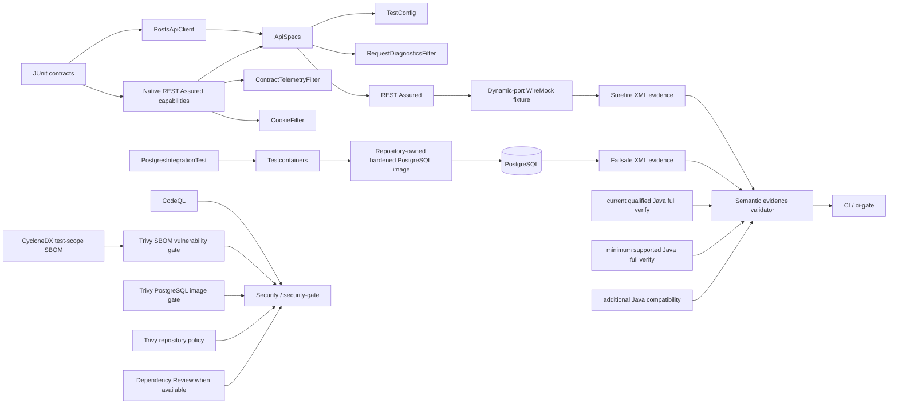

# Java / REST Assured Quality Engineering Framework

[](https://github.com/portyu9/qa-automation-java-restassured/actions/workflows/ci.yml)
[](https://github.com/portyu9/qa-automation-java-restassured/actions/workflows/extended.yml)
[](https://github.com/portyu9/qa-automation-java-restassured/actions/workflows/security.yml)
[](https://github.com/portyu9/qa-automation-java-restassured/actions/workflows/docs.yml)

[](https://www.java.com/)
[](https://maven.apache.org/)
[](https://rest-assured.io/)
[](https://junit.org/)
[](https://hamcrest.org/)
[](https://json-schema.org/)
[](https://wiremock.org/)
[](https://testcontainers.com/)
[](https://www.postgresql.org/)
[](https://www.docker.com/)
[](https://github.com/features/actions)
[](https://trivy.dev/)
[](LICENSE)
[](.github/SECURITY.md)

A Java API and persistence quality-engineering framework using **REST Assured, JUnit, Hamcrest, JSON Schema, WireMock, Testcontainers, PostgreSQL, and Maven**. It is designed around attributable test boundaries: protocol behavior, schema compatibility, semantic assertions, stateful HTTP behavior, transport diagnostics, persistence integration, runtime compatibility, evidence integrity, and repository security remain separate signals rather than collapsing into one broad “API test.”

> [!IMPORTANT]
> Required API verification is repository-owned and deterministic. REST Assured executes real HTTP requests against dynamic-port WireMock fixtures; PostgreSQL integration uses an isolated Testcontainers instance; deployed APIs are explicit targets through `TEST_BASE_URL`, never a hidden prerequisite for framework correctness.

**Read by intent:** [capabilities](#capability-map) · [architecture](#architecture) · [lifecycle](#maven-lifecycle-and-runtime-policy) · [assertion depth](#api-assertion-depth) · [evidence](#evidence-as-a-test-contract) · [PostgreSQL](#postgresql-integration-boundary) · [security](#security-and-supply-chain) · [dependencies](#dependency-maintenance) · [triage](#failure-triage)

## Capability map

| Plane | What it proves | Boundary | Evidence |
| --- | --- | --- | --- |
| Fast API | Protocol, schema, semantic, and negative behavior | REST Assured + dynamic WireMock | Surefire XML/text |
| Protocol composition | Path/query parameters, reusable specs, extraction, cookies, bounded telemetry | Native REST Assured filters/specs | JUnit/Surefire |
| Framework policy | URL safety, timeout policy, correlation identity, helper composition | Pure/local JUnit contracts | Surefire |
| External API | Provider/environment behavior | Explicit `TEST_BASE_URL` | Intentional integration signal |
| Persistence | JDBC, PostgreSQL dialect, generated identity, owned row behavior | Testcontainers + PostgreSQL | Failsafe XML/text |
| Runtime compatibility | Bytecode/runtime behavior across supported Java releases | supported Java runtimes + Maven Wrapper | Matrix/lifecycle reports |
| Evidence integrity | Intended suites actually executed with clean terminal state | Repository-owned XML validator | Minimum-count + failure/error/skip checks |
| Security | Java SAST, Maven test-dependency risk, hardened PostgreSQL runtime-image risk, repository policy/secret risk, and PR dependency-change risk | CodeQL + CycloneDX/Trivy SBOM + dedicated PostgreSQL image Trivy + repository Trivy + Dependency Review when available | Code scanning + retained SBOM/image/repository JSON + dependency-review status |
| Documentation | README/workflow/governance consistency | Repository-local validator | Actions status |

## Architecture



The architecture deliberately keeps **library capability**, **application/test policy**, **external-system realism**, and **evidence validation** separate. REST Assured remains visible instead of being hidden behind a second HTTP DSL; containers are introduced only where database semantics are material; and CI validates report semantics after Maven exits successfully.

## Engineering invariants

| Concern | Framework contract |
| --- | --- |
| Required API target | Fast tests use repository-owned dynamic-port WireMock. |
| External integration | `TestConfig.fromEnvironment()` requires explicit `TEST_BASE_URL`; there is no public fallback. |
| Request policy | Base URI, JSON `Accept`, run ID, request ID, timeouts, and diagnostics are composed once in `ApiSpecs`. |
| Native protocol surface | Query/path parameters, filters, response specs, extraction, cookies, and Hamcrest remain visible to tests. |
| Correlation | Every request carries bounded run and request identifiers. |
| Diagnostics | Shared filters retain bounded metadata, not bodies, credentials, cookies, or query strings. |
| Stateful HTTP | REST Assured `CookieFilter` is scoped to the scenario that intentionally owns state. |
| Assertion depth | Protocol, structure, semantics, and failure behavior are independent contracts. |
| HTTP simulation | WireMock models service-boundary behavior; REST Assured itself is never mocked. |
| Persistence | Testcontainers builds the repository-owned `qa-restassured-postgres:16.15-hardened` image from `docker/postgres-test.Dockerfile`; immutable upstream image digests, the gosu source identity/toolchain, patched OpenSSL floor, and final non-root user are governed independently from the Java dependency graph. |
| Lifecycle | Surefire owns fast tests; Failsafe owns `*IntegrationTest`. |
| Evidence floor | Required fast evidence proves at least 14 executed Surefire tests; full lifecycle also proves at least 1 executed Failsafe test. |
| Disabled tests | Required evidence fails when Maven XML reports skipped tests. |
| Build toolchain | The checked-in Maven Wrapper downloads the repository-pinned Maven distribution only after validating its SHA-256. |
| Supported Java | The minimum supported runtime, an additional compatibility runtime, and the current qualified Java runtime are exercised; future unqualified Java releases are rejected until deliberately supported. |
| Supported Maven | The repository-pinned Maven line is enforced; future unqualified Maven majors are rejected until deliberately supported. |
| Jackson alignment | The REST Assured schema-validator transitive graph is normalized with Jackson BOM; retained SBOM evidence proves `jackson-core` and `jackson-databind` resolve to that governed version. |
| Dependency evidence | CycloneDX generates a JSON SBOM including Maven test scope; the gate requires governed REST Assured, JUnit, Testcontainers, PostgreSQL, and Jackson components before scanning. |
| Workflow supply chain | External GitHub Actions are full-SHA pinned and checked by a repository-local validator. |
| CI safety | Read-only default permissions, least-privilege security permissions, concurrency cancellation, bounded jobs, fail-closed evidence uploads. |

## Boundary decision guide

| Requirement | Preferred boundary | Why |
| --- | --- | --- |
| Request/response protocol | REST Assured + WireMock | Preserves real HTTP semantics |
| Path/query/header/body composition | Native REST Assured DSL | Preserves library semantics and diagnostics |
| Response structure | JSON Schema | Version-controlled structural compatibility |
| Business-critical values | Hamcrest / REST Assured assertions | Structural validity is not semantic correctness |
| Stateful cookie behavior | Scoped `CookieFilter` | Makes state explicit and locally owned |
| Header/correlation behavior | Local HTTP fixture | Transport-visible policy must cross HTTP |
| Bounded observations | `ContractTelemetryFilter` | Useful diagnostics without payload retention |
| SQL dialect/driver/identity behavior | Testcontainers PostgreSQL | Real DB semantics are material |
| Provider deployment behavior | Explicit external run | Keeps environment failures attributable |

## Repository map

```text
.
├── .github/
│   ├── scripts/
│   └── workflows/
├── .mvn/
│   └── wrapper/
├── docs/
└── src/
    └── test/
        ├── java/
        │   └── com/
        │       └── example/
        │           ├── api/
        │           ├── db/
        │           ├── framework/
        │           └── testing/
        └── resources/
```

Only directories are shown in the repository map. Root files own Maven/dependency metadata, the wrapper entrypoints, licensing, and contributor policy.

## Quick start

Prerequisites are a supported Java runtime and a Docker-compatible runtime for PostgreSQL integration verification. The checked-in Maven Wrapper downloads **the repository-pinned Maven distribution** on first use and validates its repository-pinned SHA-256; a separately installed Maven is not required.

```bash
# deterministic API/framework contracts
./mvnw -B -ntp -Pfast test

# full API + PostgreSQL lifecycle
./mvnw -B -ntp verify

# documentation + workflow supply-chain contracts
python3 .github/scripts/validate_readme.py
python3 .github/scripts/validate_workflow_pins.py
```

On Windows, use `mvnw.cmd` in place of `./mvnw`.

An explicit deployed target is separate from required framework CI:

```bash
TEST_BASE_URL=https://api.test.example.internal ./mvnw -B -ntp test
```

## Runtime configuration

| Variable | Purpose | Default |
| --- | --- | --- |
| `TEST_BASE_URL` | External API base URI | required for environment-driven integration |
| `TEST_CONNECT_TIMEOUT_MS` | Connection budget | `5000` |
| `TEST_READ_TIMEOUT_MS` | Socket/read budget | `15000` |
| `TEST_RUN_ID` | Run correlation | generated UUID |

The external base URI must be absolute HTTP(S), have a hostname, and contain no credentials, query string, or fragment. Timeout values must be positive. Unsafe configuration fails before transport creation rather than becoming an opaque request error later.

## Maven lifecycle and runtime policy

Maven is part of the test architecture, not merely a command launcher. Surefire and Failsafe communicate infrastructure cost and failure domain through lifecycle ownership. Maven Enforcer guards the supported execution envelope before meaningful test work begins.

The project compiles with the configured `maven.compiler.release` minimum-runtime policy, so the test framework preserves minimum-Java bytecode/API compatibility while qualifying newer LTS runtimes independently.

Current CI is intentionally asymmetric:

- **the current qualified Java runtime** runs the complete `verify` lifecycle and is the primary execution contract;
- **the minimum supported Java runtime** and **an additional qualified Java runtime** run the deterministic fast layer in primary CI;
- **The minimum supported Java runtime** also runs a full extended lifecycle so the minimum supported runtime exercises the PostgreSQL boundary;
- future unqualified Java releases are rejected until an explicit support decision expands the matrix and Enforcer policy.

This is stronger than an unbounded minimum-version claim. Compatibility is something the repository proves, not something the version parser merely permits.

Maven itself is bounded to the repository-qualified line. The checked-in Maven Wrapper pins the selected distribution and its checksum; a future Maven major requires an explicit compatibility decision.

## Shared request policy

`ApiSpecs.request(config)` composes validated URI, `Accept: application/json`, `X-Test-Run-Id`, per-request identifiers, transport budgets, and failure diagnostics. Endpoint operations remain explicit in `PostsApiClient`; native REST Assured `Response` objects remain visible to tests.

The abstraction boundary is **policy ownership**, not syntax replacement.

## API assertion depth

A useful API contract can prove several independent dimensions:

1. **Protocol** — status, content type, headers.
2. **Structure** — JSON Schema and required shapes.
3. **Semantics** — identifiers and business-critical values.
4. **Boundary behavior** — invalid input and dependency/error responses.
5. **State** — cookies/session behavior when the scenario intentionally requires it.
6. **Side effects** — persistence when mutation semantics matter.

A schema-valid response can still represent the wrong resource. A `200` can still be semantically wrong. A passing client-side assertion does not prove persistence. These are complementary oracles, not substitutes.

## Protocol composition, state, and telemetry

`RestAssuredCapabilitiesTest` keeps first-class REST Assured behavior executable:

- `queryParam()` and `pathParam()` own request composition;
- shared request/response specifications centralize stable policy while endpoint assertions remain local;
- `.extract().path(...)` preserves native response extraction for downstream scenario logic;
- `CookieFilter` carries intentionally scoped state across related requests;
- `ContractTelemetryFilter` records method, sanitized URL path, status, and elapsed time through a bounded observation window.

`RequestDiagnosticsFilter` and `ContractTelemetryFilter` solve different problems. Diagnostics explain failure/transport behavior; telemetry proves bounded protocol observations. Neither retains request/response bodies, authorization values, query strings, or cookies.

## Deterministic HTTP boundary with WireMock

`PostsApiFixture` owns a dynamic-port WireMock server. Tests execute the normal `PostsApiClient`/REST Assured path and verify headers, correlation, JSON behavior, schemas, semantic values, stateful protocol behavior, and visible error responses.

WireMock stubs the **provider boundary**, not the HTTP client. Serialization, headers, status codes, request specifications, filters, extraction, cookies, and matcher behavior remain real framework behavior.

## PostgreSQL integration boundary

`PostgresIntegrationTest` belongs to Failsafe and provisions real PostgreSQL only because driver, SQL dialect, generated identity, and query semantics are material. Test-owned state uses a temporary table and generated identity, so reruns do not depend on global row ordering or cleanup timing.

The database boundary is **repository-owned rather than a mutable upstream tag**. `PostgresIntegrationTest` asks Testcontainers to build `qa-restassured-postgres:16.15-hardened` from `docker/postgres-test.Dockerfile`. That recipe binds the PostgreSQL 16.15 base and Go builder to immutable digests, rebuilds gosu 1.19 from its exact upstream commit with CGO disabled, patches the governed Alpine OpenSSL packages, and finishes as the non-root `postgres` user. The Security workflow rebuilds and scans that same tracked image independently, so a green persistence test cannot silently excuse a vulnerable test-runtime image.

The repository intentionally retains **Testcontainers** until a safe future-major migration is demonstrated. A prior major-version migration compiled but failed during Docker-client initialization because of an incompatible assembled Jackson annotation runtime; the future-major PostgreSQL module/package coordinates also change. That is an explicit migration boundary, not a forgotten update.

A future Testcontainers major migration should therefore prove, at minimum:

- new module/package coordinates compile cleanly;
- Docker client initialization succeeds on the supported CI host;
- PostgreSQL lifecycle and JDBC contracts pass on the minimum and current qualified Java runtimes;
- the resolved transitive graph has no accepted blocker that merely moved into a shaded layer;
- dependency/security evidence remains green.

## Evidence as a test contract

A successful Maven process is necessary but not sufficient evidence that the intended suite still exists. Repository-owned validation parses `TEST-*.xml` rather than trusting artifact presence alone.

Required fast lanes prove:

- Surefire XML exists;
- at least **14 tests actually executed**;
- failures = 0;
- errors = 0;
- skipped = 0.

Required full-lifecycle lanes additionally prove:

- Failsafe XML exists;
- at least **1 PostgreSQL integration test actually executed**;
- failures = 0;
- errors = 0;
- skipped = 0.

These floors protect against discovery regressions, renamed test patterns, silently skipped integration infrastructure, or artifact jobs that succeed while the intended suite shrinks.

Evidence directories use `if-no-files-found: error`; missing reports are failures, not successful empty artifacts.

## CI and stable gates

The workflow internals can evolve while external status interfaces remain small and durable:

- `ci / ci-gate` aggregates minimum/additional Java compatibility and current-runtime full verification;
- `extended / extended-gate` aggregates the minimum-supported-runtime full lifecycle;
- `security / security-gate` aggregates CodeQL, Maven test-scope SBOM vulnerability scanning, the exact hardened PostgreSQL Testcontainers image scan, repository Trivy policy scanning, and event-applicable Dependency Review/fallback behavior.

Repository rules/settings are a separate governance layer. The workflows expose stable conclusions without implying that a particular repository rule is configured.

## Security and supply chain

Security controls remain independent because they answer different questions:

- **CodeQL `security-extended`** analyzes Java source/data-flow behavior after a controlled test compilation;
- **Maven test-dependency SBOM gate** uses repository-pinned CycloneDX Maven plugin with test scope included, verifies governed REST Assured/JUnit/Testcontainers/PostgreSQL components plus Jackson BOM alignment, then scans that retained SBOM with the repository-pinned Trivy scanner for fixable HIGH/CRITICAL vulnerabilities;
- **PostgreSQL Testcontainers image gate** validates the tracked runtime provenance, rebuilds `qa-restassured-postgres:16.15-hardened`, and scans the actual image for fixable HIGH/CRITICAL vulnerabilities with retained image identity/evidence;
- **repository Trivy policy** scans committed repository configuration and secret material independently of Maven dependency resolution;
- **Dependency Review** evaluates newly introduced dependency risk on pull requests when GitHub Dependency graph is available;
- **Maven Wrapper provenance** pins the repository-pinned Maven distribution and verifies its SHA-256 before execution;
- **workflow pin validation** requires every external GitHub Action reference to be a full immutable commit SHA.

The SBOM gate exists because repository-filesystem scanning alone does not reliably prove the resolved Maven **test** dependency graph. Missing SBOM or Trivy JSON evidence is a failure, and artifact uploads use `if-no-files-found: error`.

If GitHub Dependency graph is unavailable, the workflow records that limitation. The Maven SBOM vulnerability gate and repository Trivy policy remain independent required controls, but neither is represented as equivalent to change-aware dependency-diff analysis.

The REST Assured JSON-schema-validator path currently reaches `java-json-tools`, which otherwise selects an older transitive Jackson release. The repository imports **Jackson BOM** so `jackson-core` and `jackson-databind` resolve as one coherent patched family. The SBOM validator requires both components at that governed version and rejects conflicting versions before vulnerability scanning.

## Confidence boundaries

The framework combines real HTTP and real relational-database execution with deterministic local control, but each signal is still scoped to the boundary actually exercised.

| Signal | Confidence gained | Deliberate limit |
| --- | --- | --- |
| REST Assured API contracts | HTTP status, headers, payload semantics, schema checks, and client-facing error behavior execute through the governed API boundary | Passing API contracts do not prove browser behavior, upstream integrations, or production ingress/network policy |
| JSON Schema validation | Provider responses retain the committed structural contract | Structural validity does not prove business correctness, authorization correctness, or semantic compatibility outside the asserted fields |
| WireMock-controlled dependencies | Timeout, error, and dependency-response conditions are reproducible and attributable | A controlled stub proves the owned condition, not the current behavior of a live third-party service |
| Testcontainers PostgreSQL integration | Repository/transaction behavior executes against a real PostgreSQL engine built from the governed hardened image recipe, with isolated lifecycle ownership | It does not prove managed-service topology, replication, failover, production sizing, network policy, or migration safety in a deployed estate |
| Unit/integration lifecycle separation | Fast contracts and infrastructure-bearing tests retain distinct Maven lifecycle ownership and failure attribution | A green unit phase is not evidence that container/integration prerequisites are healthy, and the reverse is also true |
| Dependency lock / resolved graph / SBOM evidence | The build records the dependency graph actually selected for the governed execution | A generated SBOM is inventory evidence, not a vulnerability verdict or proof that every runtime path loads every component |
| Runtime compatibility lanes | The same governed suite executes across explicitly supported Java runtimes | Compatibility is scoped to exercised code paths; it does not guarantee behavior under unqualified future runtimes or JVM/environment tuning |
| CodeQL / dependency vulnerability analysis / Trivy / dependency review | Independent controls inspect source, dependency, repository/configuration, secret, and change-diff risk planes | Scanner success remains bounded by rule coverage, advisory data, repository visibility, and the evidence retained |

Use **real infrastructure when infrastructure semantics are the requirement**, not merely to make a test appear more integrated. Deterministic doubles remain appropriate for owned dependency conditions; real PostgreSQL is appropriate where SQL/transaction/driver behavior itself must be proven.

## Dependency maintenance

Dependabot maintains **Maven** and **GitHub Actions** dependencies. Maven execution itself is pinned separately through the checked-in Wrapper, repository-pinned distribution, and verified distribution checksum.

- weekly Monday maintenance cadence;
- minor/patch updates can be grouped for efficient review;
- major upgrades remain attributable compatibility changes;
- Actions are executable dependencies and remain immutable-SHA pinned;
- wrapper changes require deliberate version/checksum changes plus full lifecycle verification;
- dependency PRs must satisfy Enforcer, compilation, semantic Surefire/Failsafe evidence, compatibility, test-scope SBOM vulnerability scanning, hardened PostgreSQL image provenance/scanning when applicable, repository security, and documentation gates.

Dependabot can update dependencies whose package coordinates remain stable, including the imported Jackson BOM. Migrations that rename modules or Java packages require deliberate code changes. A future Testcontainers major is such a migration and its major updates are intentionally excluded from automated Dependabot PRs while maintenance within the currently qualified Testcontainers major remains enabled.

## Failure triage

| Signal | First interpretation |
| --- | --- |
| Enforcer failure | Unsupported Java/Maven runtime |
| Wrapper checksum failure | Build-tool provenance failure |
| minimum/additional-runtime fast-only failure | Runtime compatibility or bytecode/API assumption |
| current-runtime full-only failure | Current-LTS/runtime or persistence interaction |
| minimum-runtime extended full-only failure | Minimum-runtime persistence integration |
| Surefire evidence-floor failure | Fast-suite discovery, skips, or report-integrity regression |
| Failsafe evidence-floor failure | Integration discovery/container execution/report regression |
| WireMock-only failure | HTTP contract/request-policy behavior |
| JSON Schema failure | Structural compatibility or Jackson/schema-validator compatibility regression |
| Semantic assertion failure | API business/data contract |
| Cookie-filter failure | Stateful HTTP semantics |
| PostgreSQL runtime-provenance failure | Tracked Dockerfile/Testcontainers wiring, immutable upstream identity, gosu toolchain/source, OpenSSL patch floor, or non-root runtime drift |
| PostgreSQL image security failure | Fixable HIGH/CRITICAL vulnerability in the exact repository-built test image |
| PostgreSQL Failsafe failure | Container/driver/SQL/persistence boundary |
| External-target-only failure | Environment/provider integration first |
| CodeQL failure | Source-level security signal |
| Maven SBOM validation failure | Resolved dependency scope/alignment evidence is missing or drifted |
| Maven SBOM Trivy failure | Fixable HIGH/CRITICAL vulnerability exists in the resolved test dependency graph |
| Repository Trivy failure | HIGH/CRITICAL supported configuration finding or committed-secret signal |
| Dependency Review unavailable | GitHub service limitation; not a synthetic pass for diff-aware analysis |
| Documentation/workflow-pin failure | Repository governance or executable supply-chain drift |

## Explicit anti-patterns

- public demonstration APIs as required CI dependencies;
- validating only HTTP status while ignoring structure/semantics;
- hiding REST Assured behind a generic HTTP wrapper;
- global mutable `RestAssured.baseURI` state shared across unrelated tests;
- logging request/response bodies or credentials from global filters;
- containers used where a pure/local contract would prove the same requirement more cheaply;
- mutable database image tags in deterministic integration gates;
- treating a passing Maven exit code as proof that the intended test count ran;
- accepting skipped integration tests as successful persistence evidence;
- treating repository filesystem scanning as proof of a resolved Maven test graph;
- overriding one vulnerable Jackson jar without governing the compatible Jackson family;
- unbounded Java or Maven version claims without corresponding CI qualification;
- forcing ecosystem migrations merely because an update tool can identify a higher version.

## Design references

- [`docs/ARCHITECTURE.md`](docs/ARCHITECTURE.md) — runtime, HTTP, persistence, diagnostics, and evidence boundaries.
- [`docs/TEST_STRATEGY.md`](docs/TEST_STRATEGY.md) — layer selection, runtime qualification, lifecycle ownership, and exit criteria.
- [`CONTRIBUTING.md`](CONTRIBUTING.md) — change-quality expectations.
- [Security policy](.github/SECURITY.md)

A strong REST Assured framework makes the failed boundary obvious: **configuration, HTTP policy, structure, semantics, stateful protocol behavior, runtime compatibility, persistence integration, evidence integrity, supply chain, or explicit environment integration**.
