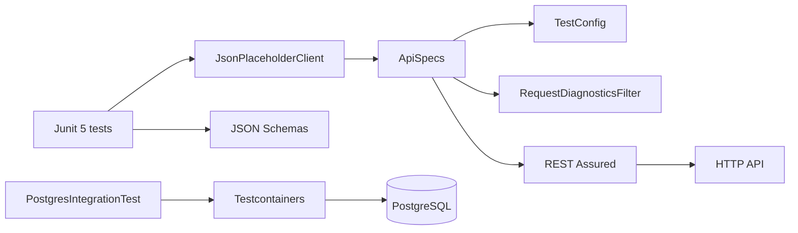
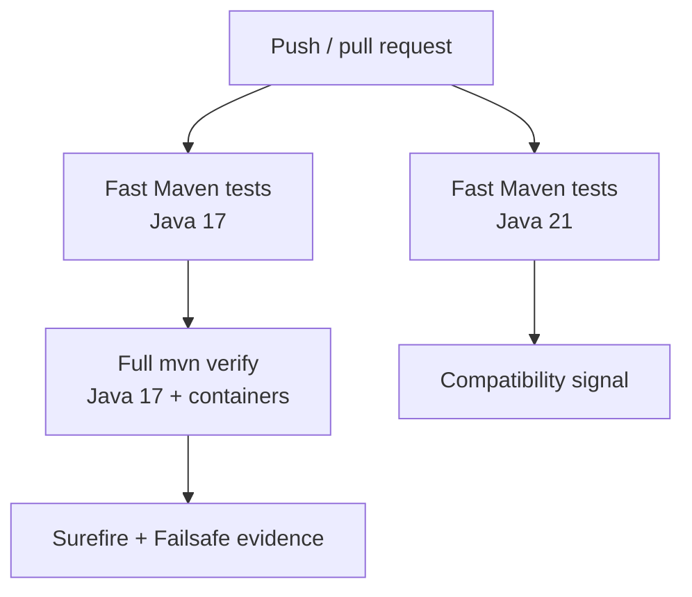

# Java / REST Assured API Automation Framework

A Java API and persistence test framework using REST Assured, JUnit 5, Hamcrest, JSON Schema validation, Testcontainers, and Maven. Shared request specifications enforce runtime configuration and transport budgets; a native REST Assured filter adds request-level correlation and bounded diagnostics; API tests combine protocol, semantic, and version-controlled schema assertions.

## Engineering contract

| Concern | Framework policy |
| --- | --- |
| Configuration | Environment values are parsed into immutable `TestConfig` with URI and timeout validation. |
| Request policy | Base URI, accepted content type, run correlation, transport timeouts, and diagnostics are composed in one shared request specification. |
| Request correlation | Every request receives a unique `X-Test-Request-Id` in addition to the run-level `X-Test-Run-Id`. |
| Diagnostics | The REST Assured filter logs method/status/duration/error class only; automatic payload and credential dumps are avoided. |
| Assertions | Protocol checks, semantic values, and JSON Schema validation are complementary. |
| Persistence | Integration tests use containerized PostgreSQL where a real database boundary is required. |
| Build lifecycle | Surefire owns fast tests; Failsafe owns `*IntegrationTest` verification. |
| Compatibility | CI validates Java 17 and 21 fast layers and runs full integration verification on Java 17. |

## Architecture



Framework policy is composed through REST Assured rather than hidden behind a custom HTTP DSL. Tests still use normal REST Assured responses and Hamcrest assertions.

## Repository layout

```text
.
├── src/test/java/com/example/
│   ├── api/
│   │   ├── JsonPlaceholderClient.java
│   │   └── PostApiTest.java
│   ├── db/
│   │   └── PostgresIntegrationTest.java
│   └── framework/
│       ├── ApiSpecs.java
│       ├── RequestDiagnosticsFilter.java
│       ├── TestConfig.java
│       └── FrameworkContractTest.java
├── src/test/resources/
│   ├── post-schema.json
│   └── single-post-schema.json
├── docs/
│   ├── ARCHITECTURE.md
│   └── TEST_STRATEGY.md
├── pom.xml
└── .github/workflows/ci.yml
```

## Quick start

Prerequisites:

- Java 17 or newer;
- Maven 3.9+;
- Docker-compatible container runtime for integration tests.

Fast test gate:

```bash
mvn -B -Pfast test
```

Full verification, including Failsafe integration tests:

```bash
mvn -B verify
```

The Maven Enforcer configuration rejects unsupported Java/Maven versions before test execution.

## Runtime configuration

`TestConfig` is the environment boundary for HTTP behavior.

| Variable | Purpose | Default |
| --- | --- | --- |
| `TEST_BASE_URL` | API base URI | `https://jsonplaceholder.typicode.com` |
| `TEST_CONNECT_TIMEOUT_MS` | HTTP connection budget | `5000` |
| `TEST_READ_TIMEOUT_MS` | HTTP socket/read budget | `15000` |
| `TEST_RUN_ID` | Run-level correlation identifier | generated UUID |

The base URI must be absolute HTTP(S). Timeout values must be positive integers. Invalid values fail before requests are executed.

## Request specification

`ApiSpecs.request(config)` composes the reusable request policy:

- configured base URI;
- `Accept: application/json`;
- `X-Test-Run-Id` run correlation;
- connect/socket timeout configuration;
- `RequestDiagnosticsFilter`.

`ApiSpecs.jsonResponse()` supplies the shared JSON response content-type expectation.

The specification is policy, not a custom client language. Endpoint behavior remains visible in `JsonPlaceholderClient` and tests retain native REST Assured responses.

## Correlation and diagnostics

Two correlation levels are intentionally separate:

```text
Test run
└── X-Test-Run-Id: gha-12345-1
    ├── X-Test-Request-Id: <uuid-1>
    ├── X-Test-Request-Id: <uuid-2>
    └── X-Test-Request-Id: <uuid-3>
```

`RequestDiagnosticsFilter` creates the request ID immediately before transport execution. It measures elapsed time and emits bounded diagnostics for:

- HTTP status 400+;
- transport/runtime exceptions.

Automatic log fields are limited to request ID, method, status, duration, and exception class. The filter intentionally avoids request bodies, response bodies, authorization headers, cookies, and full URLs as a safe default for shared CI logs.

Tests can still inspect response bodies explicitly when those values are part of the assertion contract.

## API assertion depth

A meaningful API test generally covers multiple dimensions:

1. **Protocol** — status and content type.
2. **Structure** — JSON Schema.
3. **Semantics** — identifiers and critical values.
4. **Boundary behavior** — invalid inputs and dependency failures where applicable.
5. **Side effects** — persistence/event state for mutating APIs when observable.

The posts tests currently prove:

- list response is successful JSON;
- list is non-empty;
- required identifiers are positive;
- title/body values are non-empty;
- every list item satisfies the collection schema;
- a requested post ID is returned unchanged;
- the single resource satisfies its dedicated object schema.

## JSON Schema strategy

Two schemas are maintained because list and item endpoints have different top-level contracts:

```text
post-schema.json
└── array
    └── post object

single-post-schema.json
└── post object
```

Both schemas constrain required fields and basic semantic minima. `additionalProperties: true` permits additive provider fields without making every harmless response expansion a breaking test change.

Schema assertions do not replace semantic assertions. A response may be structurally valid while returning the wrong requested resource.

## Database integration layer

`PostgresIntegrationTest` belongs to the Maven integration-test lifecycle and uses Testcontainers to provision a real PostgreSQL boundary. Containerized integration tests are appropriate when SQL dialect, transaction behavior, schema compatibility, or driver interaction matters.

Prefer an in-process/fake boundary for logic that does not require PostgreSQL semantics. A container should prove a real integration property, not merely make a test appear more realistic.

## Maven lifecycle

The project separates test speeds through standard Maven plugins:

| Lifecycle | Plugin | Scope |
| --- | --- | --- |
| `test` | Surefire | Fast unit/API/framework tests; excludes `*IntegrationTest`. |
| `verify` | Failsafe | Integration tests such as containerized PostgreSQL. |
| `-Pfast test` | Fast profile | Explicit pull-request-friendly execution without integration verification. |

This keeps test selection visible to Maven tooling and CI rather than relying on custom shell filtering.

## CI topology



CI uses current Java setup actions, Maven caching, separate fast/integration jobs, and bounded test-result artifacts.

## Failure triage

| Signal | Likely boundary | First action |
| --- | --- | --- |
| Enforcer failure | Toolchain | Use supported Java/Maven versions. |
| `TestConfig` exception | Runtime configuration | Correct URI/timeout environment values. |
| Transport exception diagnostic | Network/dependency | Inspect connectivity and timeout class before assertions. |
| HTTP 4xx/5xx diagnostic | API/dependency behavior | Use request ID to correlate external logs if available. |
| JSON Schema failure | Structural contract | Compare provider shape and versioned schema. |
| Hamcrest semantic failure | Business/API behavior | Inspect the specific response field being asserted. |
| Testcontainers startup failure | Docker/runner infrastructure | Inspect container runtime, image pull, and resource availability. |
| Failsafe-only failure | Integration boundary | Keep fast test conclusions separate from database integration diagnosis. |

Avoid enabling broad REST Assured body logging globally as a first response. It creates noisy CI output and can leak sensitive payloads.

## Extension rules

When adding an API resource:

- add client methods that represent resource operations rather than a generic HTTP wrapper;
- use the shared request/response specifications;
- keep run/request correlation intact;
- add a version-controlled schema where structural validation adds value;
- add semantic assertions for critical business values;
- keep automatic diagnostics payload-safe;
- use integration tests only when an actual external-system semantic is required.

When adding framework policy:

- extend `TestConfig` for new environment inputs;
- extend `ApiSpecs` for common REST Assured policy;
- use filters for cross-cutting request/response observation;
- add `FrameworkContractTest` coverage for infrastructure invariants where possible;
- keep Maven lifecycle boundaries explicit.

## Anti-patterns

The framework intentionally avoids:

- environment parsing inside individual tests;
- unbounded request timeouts;
- full request/response body logging as a global failure hook;
- one schema reused for endpoints with different top-level shapes;
- status-code-only API tests;
- client methods that merely expose `get(path)`/`post(path)` generically;
- Testcontainers for logic that can be proven in-process;
- mixing integration tests into the fast Surefire gate by naming accident;
- retries that hide deterministic assertion failures.

## Further design documentation

- [`docs/ARCHITECTURE.md`](docs/ARCHITECTURE.md) — REST Assured, configuration, API client, and persistence boundaries.
- [`docs/TEST_STRATEGY.md`](docs/TEST_STRATEGY.md) — layer selection, schema/semantic assertions, integration policy, and release gates.

The framework should keep each API failure attributable to **configuration**, **transport**, **protocol**, **structure**, **semantics**, or **persistence integration** while preserving the native REST Assured/JUnit debugging experience.
