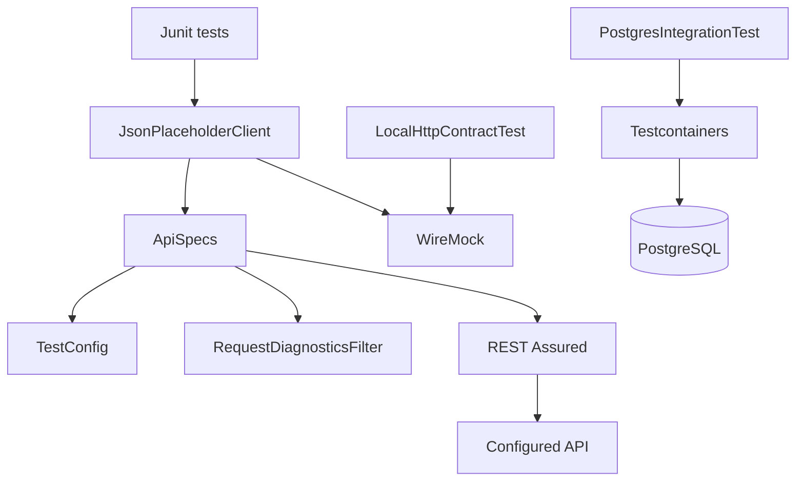
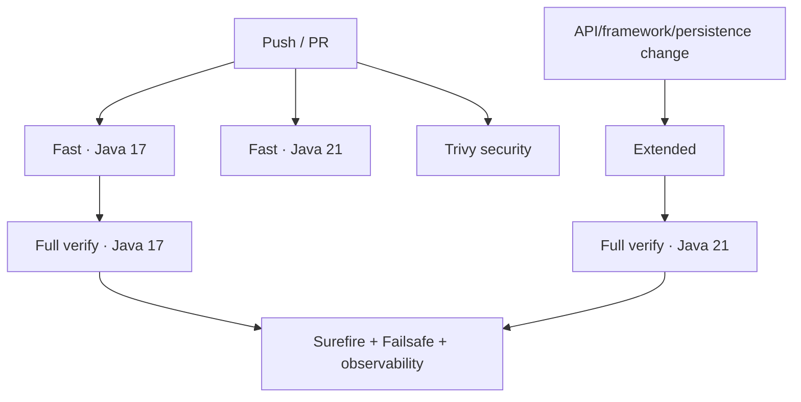

# Java / REST Assured Quality Engineering Framework

[](https://github.com/portyu9/qa-automation-java-restassured/actions/workflows/ci.yml)
[](https://github.com/portyu9/qa-automation-java-restassured/actions/workflows/extended.yml)
[](https://github.com/portyu9/qa-automation-java-restassured/actions/workflows/security.yml)

[](https://www.java.com/)
[](https://maven.apache.org/)
[](https://rest-assured.io/)
[](https://junit.org/junit5/)
[](https://hamcrest.org/)
[](https://json-schema.org/)
[](https://wiremock.org/)
[](https://testcontainers.com/)
[](https://www.postgresql.org/)
[](https://www.docker.com/)
[](https://github.com/features/actions)
[](https://trivy.dev/)
[](LICENSE)
[](.github/SECURITY.md)

A Java API and persistence quality-engineering framework using **REST Assured**, **JUnit 5**, **Hamcrest**, **JSON Schema**, **WireMock**, **Testcontainers**, PostgreSQL, and Maven lifecycle separation. Shared request specifications enforce validated runtime configuration, transport budgets, run correlation, and request-level diagnostics while tests retain normal REST Assured responses and assertions.

> [!IMPORTANT]
> The framework separates **HTTP policy**, **API semantics**, **deterministic dependency behavior**, and **real persistence integration**. A local WireMock boundary should prove transport/protocol contracts; a PostgreSQL container should prove database semantics; neither should be introduced when an in-process assertion can prove the requirement more directly.

## Capability map

| Plane | What it proves | Boundary | Evidence |
| --- | --- | --- | --- |
| Fast API | Protocol + schema + semantic behavior | REST Assured HTTP client | Surefire reports + request diagnostics |
| Local HTTP contract | Shared headers/correlation + error-status behavior | WireMock dynamic port | JUnit/Surefire |
| Persistence integration | PostgreSQL driver/schema/transaction behavior | Testcontainers PostgreSQL | Failsafe reports |
| Compatibility | Java runtime compatibility | Java 17 + 21 | Matrix test reports |
| Extended lifecycle | Full API + WireMock + PostgreSQL lifecycle on Java 21 | `mvn verify` | Surefire + Failsafe |
| Security | Dependency/configuration exposure | Pinned Trivy filesystem scan | JSON findings + Markdown summary |
| Observability | Run/runtime identity | Structured CI envelope + request IDs | `reports/ci-observability-*.json`, Actions summary |



## Engineering invariants

| Concern | Framework contract |
| --- | --- |
| Configuration | `TestConfig` validates base URI, timeout budgets, and run identity before requests. |
| Request policy | Base URI, JSON Accept, run ID, transport budgets, and diagnostics are composed once in `ApiSpecs`. |
| Correlation | Every request has `X-Test-Run-Id` plus a generated `X-Test-Request-Id`. |
| Diagnostics | Shared filter logs method/status/duration/error class—not arbitrary bodies or credentials. |
| Assertions | Protocol, structure, and semantics are complementary contracts. |
| Local dependency simulation | WireMock is used when HTTP behavior itself is under test. |
| Persistence integration | Testcontainers is used when PostgreSQL semantics are material. |
| Lifecycle | Surefire owns fast tests; Failsafe owns `*IntegrationTest` verification. |
| Compatibility | Java 17/21 fast validation; extended Java 21 full verification supplements Java 17 full CI. |

## Repository map

```text
.
├── src/test/java/com/example/
│   ├── api/
│   │   ├── JsonPlaceholderClient.java
│   │   ├── PostApiTest.java
│   │   └── LocalHttpContractTest.java
│   ├── db/PostgresIntegrationTest.java
│   └── framework/
│       ├── ApiSpecs.java
│       ├── RequestDiagnosticsFilter.java
│       ├── TestConfig.java
│       └── FrameworkContractTest.java
├── src/test/resources/
│   ├── post-schema.json
│   └── single-post-schema.json
├── docs/
│   ├── ARCHITECTURE.md
│   └── TEST_STRATEGY.md
├── .github/workflows/
│   ├── ci.yml
│   ├── extended.yml
│   └── security.yml
└── pom.xml
```

## Quick start

Prerequisites:

- Java 17+;
- Maven 3.9+;
- Docker-compatible runtime for integration verification.

Fast gate:

```bash
mvn -B -ntp -Pfast test
```

Full lifecycle:

```bash
mvn -B -ntp verify
```

The Maven Enforcer plugin rejects unsupported Java/Maven versions before the test lifecycle proceeds.

<details>
<summary><strong>Lifecycle reference</strong></summary>

| Invocation | Primary scope |
| --- | --- |
| `mvn -B -ntp -Pfast test` | Surefire fast API/framework/WireMock tests; skips integration verification. |
| `mvn -B -ntp test` | Surefire fast tests. |
| `mvn -B -ntp verify` | Surefire + Failsafe integration lifecycle. |

`*IntegrationTest` naming is part of lifecycle ownership. Do not make a test “fast” or “integration” through ad-hoc shell filtering when Maven already has a first-class lifecycle boundary.

</details>

## Runtime configuration

`TestConfig` is the HTTP configuration boundary.

| Variable | Purpose | Default |
| --- | --- | --- |
| `TEST_BASE_URL` | API base URI | `https://jsonplaceholder.typicode.com` |
| `TEST_CONNECT_TIMEOUT_MS` | Connection budget | `5000` |
| `TEST_READ_TIMEOUT_MS` | Socket/read budget | `15000` |
| `TEST_RUN_ID` | Run correlation | generated UUID |

The base URI must be absolute HTTP(S), have a hostname, and contain no URL credentials, query string, or fragment. Timeout values must be positive.

## Shared request specification

`ApiSpecs.request(config)` composes cross-cutting request behavior:

- validated base URI;
- `Accept: application/json`;
- `X-Test-Run-Id`;
- connect/socket timeout configuration;
- `RequestDiagnosticsFilter`.

`ApiSpecs.jsonResponse()` provides the common JSON content-type expectation.

The specification is policy—not a new HTTP language. Endpoint operations remain explicit in `JsonPlaceholderClient`, and tests still inspect native REST Assured `Response` objects.

## Correlation and diagnostics

```text
Test run
└── X-Test-Run-Id
    ├── X-Test-Request-Id: uuid-1
    ├── X-Test-Request-Id: uuid-2
    └── X-Test-Request-Id: uuid-3
```

`RequestDiagnosticsFilter` generates request identity immediately before transport, measures elapsed time, and emits bounded metadata for HTTP 4xx/5xx responses or runtime/transport exceptions.

Automatic shared diagnostics exclude:

- request/response bodies;
- authorization values;
- cookies;
- full URLs.

Tests remain free to assert response bodies explicitly when those values are part of the contract.

## API assertion depth

A meaningful API test generally addresses multiple independent dimensions:

1. **Protocol** — status/content type.
2. **Structure** — JSON Schema.
3. **Semantics** — identifiers and business-critical values.
4. **Boundary behavior** — invalid/error responses.
5. **Side effects** — persistence/event state when the API mutates observable state.

A schema-valid response can still be the wrong resource. A 200 response can still violate business semantics. A semantic assertion without a structure contract can miss incompatible shape drift.

## JSON Schema strategy

List and item endpoints have different top-level structures, so they use distinct version-controlled schemas:

```text
post-schema.json
└── array of post objects

single-post-schema.json
└── one post object
```

Required fields and semantic minima are constrained while `additionalProperties: true` permits additive provider fields without turning harmless expansions into false breaking changes.

## Deterministic HTTP boundary with WireMock

`LocalHttpContractTest` uses a dynamic-port `WireMockServer` to verify behavior at the actual HTTP boundary without public-service variability.

It proves that the existing client sends:

- `Accept: application/json`;
- the configured `X-Test-Run-Id`;
- a generated UUID-shaped `X-Test-Request-Id`.

It also verifies that a JSON `503` remains visible to the test as a protocol/error response rather than being hidden by a custom client wrapper.

> [!NOTE]
> WireMock is appropriate here because headers, status, and transport-visible behavior are the subject. It should not be used to replace simple pure/unit assertions that do not require HTTP semantics.

## PostgreSQL integration boundary

`PostgresIntegrationTest` belongs to Failsafe and provisions a real PostgreSQL container when SQL dialect, schema compatibility, transaction semantics, or driver behavior matters.

A container is not a realism badge. It is justified only when the real external-system semantics are part of the requirement.

## Compatibility and extended validation

Primary CI:

- fast tests on Java 17 and 21;
- full `mvn verify` on Java 17.

`extended.yml` runs full `mvn verify` on Java 21, adding a second full-lifecycle signal for:

- REST Assured/JUnit behavior;
- WireMock local HTTP contract;
- Maven Surefire/Failsafe integration;
- PostgreSQL Testcontainers runtime compatibility.

This keeps ordinary CI efficient while still validating the complete stack on both supported Java generations over the combined primary/extended gates.

## Security engineering

`.github/workflows/security.yml` uses open-source Trivy filesystem scanning. The GitHub Action is pinned to immutable commit `ed142fd0673e97e23eac54620cfb913e5ce36c25` (`v0.36.0`) with Trivy engine `v0.74.0`.

The configured blocking set focuses on fixed HIGH/CRITICAL dependency vulnerabilities and HIGH/CRITICAL supported repository/configuration misconfigurations. `reports/security/trivy.json` and `summary.md` are retained for remediation-focused triage.

## Observability model

CI combines two levels of correlation:

```text
GitHub Actions run
└── TEST_RUN_ID
    ├── Java runtime dimension
    ├── per-request X-Test-Request-Id
    ├── Surefire/Failsafe reports
    └── reports/ci-observability-java-<version>.json
```

The CI envelope contains schema version, framework identity, run ID, Java dimension, final job status, SHA, and ref. It is intentionally small and vendor-neutral; detailed failure semantics remain in JUnit/Maven reports and request diagnostics.

No external telemetry backend is required. The JSON records can later feed open-source collectors/log stores without embedding a telemetry provider into the tests.

## CI topology



## Failure triage

| Signal | Boundary | First action |
| --- | --- | --- |
| Enforcer failure | Toolchain | Use supported Java/Maven versions |
| `TestConfig` failure | Runtime input | Correct URI/timeout/run configuration |
| WireMock contract failure | Shared HTTP policy | Inspect outbound header/status semantics |
| Transport exception diagnostic | Dependency/network | Classify connectivity/timeout before assertions |
| HTTP 4xx/5xx | Protocol/application/dependency | Correlate by request ID |
| JSON Schema failure | Structural contract | Compare response shape and schema |
| Hamcrest semantic failure | API behavior | Inspect asserted field/value |
| Testcontainers startup | Runtime infrastructure | Inspect Docker/image/resources |
| Failsafe-only failure | Persistence integration | Keep integration diagnosis separate from fast API conclusions |
| Java-21-only full failure | Runtime compatibility | Compare tool/runtime behavior before changing semantics |
| Trivy failure | Dependency/configuration risk | Triage exact JSON finding/remediation |

> [!WARNING]
> Broad REST Assured body logging is not a first-response debugging strategy. It increases noise and can leak payloads while doing nothing to classify the failing boundary.

## Extension rules

When adding API behavior:

1. keep resource operations explicit in the client;
2. reuse shared request/response policy;
3. preserve run/request correlation;
4. add version-controlled schemas where structural validation matters;
5. assert critical semantics separately from shape;
6. use WireMock when HTTP dependency behavior is the requirement;
7. use Testcontainers only when real external-system semantics are required;
8. add framework-contract tests for new cross-cutting policy;
9. keep Maven lifecycle ownership explicit;
10. keep automatic diagnostics bounded and payload-safe.

## Explicit anti-patterns

- environment parsing inside tests;
- unbounded HTTP timeouts;
- global body logging;
- one schema forced onto different endpoint shapes;
- status-code-only tests;
- generic client methods that only expose HTTP verbs/paths;
- Testcontainers for logic that can be proven in-process;
- integration tests accidentally entering Surefire by naming drift;
- retries hiding deterministic assertions;
- local WireMock tests treated as proof of provider availability.

## Design references

- [`docs/ARCHITECTURE.md`](docs/ARCHITECTURE.md) — REST Assured, configuration, correlation, dependency, and persistence boundaries.
- [`docs/TEST_STRATEGY.md`](docs/TEST_STRATEGY.md) — assertion depth, deterministic HTTP boundaries, integration policy, and gates.

> [!TIP]
> API-test depth is not the number of libraries involved. It is the precision with which the suite can distinguish configuration, transport, protocol, structure, semantics, and persistence failures while keeping each test at the cheapest boundary that can prove the requirement.