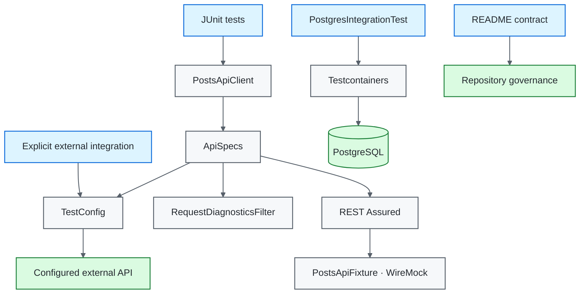
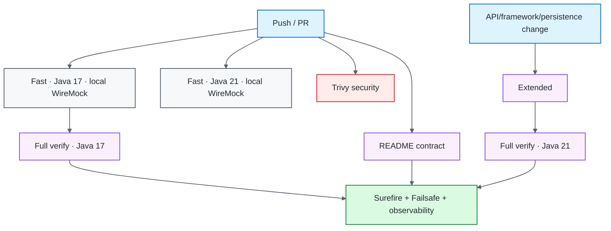

# Java / REST Assured Quality Engineering Framework

[](https://github.com/portyu9/qa-automation-java-restassured/actions/workflows/ci.yml)
[](https://github.com/portyu9/qa-automation-java-restassured/actions/workflows/extended.yml)
[](https://github.com/portyu9/qa-automation-java-restassured/actions/workflows/security.yml)
[](https://github.com/portyu9/qa-automation-java-restassured/actions/workflows/docs.yml)

[](https://www.java.com/)
[](https://maven.apache.org/)
[](https://rest-assured.io/)
[](https://junit.org/junit5/)
[](https://hamcrest.org/)
[](https://json-schema.org/)
[](https://wiremock.org/)
[](https://testcontainers.com/)
[](https://www.postgresql.org/)
[](https://www.docker.com/)
[](https://github.com/features/actions)
[](https://trivy.dev/)
[](LICENSE)
[](.github/SECURITY.md)

A Java API and persistence quality-engineering framework using **REST Assured**, **JUnit 5**, **Hamcrest**, **JSON Schema**, **WireMock**, **Testcontainers**, PostgreSQL, and Maven lifecycle separation. Shared request specifications enforce validated runtime configuration, transport budgets, run correlation, and request-level diagnostics while tests retain normal REST Assured responses and assertions.

> [!IMPORTANT]
> Required API CI is deterministic and repository-owned. REST Assured exercises real HTTP semantics against dynamic-port WireMock fixtures; public or deployed API targets are explicit integration choices through `TEST_BASE_URL`, not prerequisites for framework correctness.

## Capability map

| Plane | What it proves | Boundary | Evidence |
| --- | --- | --- | --- |
| Fast API | Protocol + schema + semantic behavior | REST Assured + dynamic-port WireMock | Surefire reports + request diagnostics |
| Local HTTP contract | Shared headers/correlation + error-status behavior | WireMock dynamic port | JUnit/Surefire |
| External API integration | Provider/environment behavior | Explicit `TEST_BASE_URL` | REST Assured/JUnit when intentionally invoked |
| Persistence integration | PostgreSQL driver/schema/transaction behavior | Testcontainers PostgreSQL | Failsafe reports |
| Compatibility | Java runtime compatibility | Java 17 + 21 | Matrix test reports |
| Extended lifecycle | Full local API + PostgreSQL lifecycle on Java 21 | `mvn verify` | Surefire + Failsafe |
| Security | Dependency/configuration exposure | Pinned Trivy filesystem scan | JSON findings + Markdown summary |
| Documentation contract | README links, workflow badges, Mermaid declarations, governance surfaces, badge palette | Repository-local Python stdlib validation | Actions status |
| Observability | Run/runtime/target identity | Structured CI envelope + request IDs | `reports/ci-observability-*.json`, Actions summary |



## Engineering invariants

| Concern | Framework contract |
| --- | --- |
| Required API target | Surefire API tests use repository-owned dynamic-port WireMock fixtures. |
| External integration | Environment-driven execution requires explicit `TEST_BASE_URL`; no public fallback exists. |
| Configuration | `TestConfig` validates base URI, timeout budgets, and run identity before requests. |
| Request policy | Base URI, JSON Accept, run ID, transport budgets, and diagnostics are composed once in `ApiSpecs`. |
| Correlation | Every request has `X-Test-Run-Id` plus a generated `X-Test-Request-Id`. |
| Diagnostics | Shared filter logs method/status/duration/error class—not arbitrary bodies or credentials. |
| Assertions | Protocol, structure, and semantics are complementary contracts. |
| Local dependency simulation | `PostsApiFixture` owns WireMock lifecycle; dynamic ports avoid shared fixed-service coupling. |
| Header contracts | WireMock accepts the real `Accept` header semantics rather than assuming an exact single media-type string. |
| Persistence integration | Testcontainers is used when PostgreSQL semantics are material. |
| Lifecycle | Surefire owns fast tests; Failsafe owns `*IntegrationTest` verification. |
| Compatibility | Java 17/21 fast validation; extended Java 21 full verification supplements Java 17 full CI. |
| CI safety | Read-only permissions, concurrency cancellation, and bounded job time are enforced. |
| Documentation | README-local references, workflow badges, Mermaid roots, governance files, and static badge-color uniqueness are executable contracts. |

## Tool ownership model

| Tool / technology | Native responsibility | Framework responsibility | Deliberately left visible |
| --- | --- | --- | --- |
| JUnit Jupiter | Test lifecycle, discovery, assertions/extensions | Test grouping and framework-contract placement | JUnit exception/test identity remains the primary test signal |
| Maven | Dependency resolution, compilation and lifecycle orchestration | Enforcer policy, deterministic commands, Surefire/Failsafe separation | Maven/Enforcer/compile failures are not reclassified as API failures |
| Surefire / Failsafe | Fast-test vs integration-test lifecycle execution | Naming conventions and CI topology | `*IntegrationTest` lifecycle ownership remains explicit |
| REST Assured | HTTP request/response DSL, filters, response extraction | Shared request specification, client resource methods, bounded diagnostics | Native `Response`, status/content/JSON-path semantics remain visible |
| Hamcrest | Semantic matcher expressions | Express business-critical field/value expectations separately from schema | Matcher failure stays an assertion signal rather than a transport failure |
| JSON Schema validator | Structural response compatibility | Version-control distinct list/item schemas and combine shape with semantics | Schema validity is not treated as proof of correct resource values |
| WireMock | Deterministic HTTP server/stubbing/request verification | Repository-owned API fixture, dynamic-port transport, header/correlation/error contracts | WireMock is not used as proof of external-provider availability |
| Testcontainers | Container lifecycle and mapped connectivity | Real PostgreSQL integration boundary when DB semantics matter | Docker/runtime startup failures remain infrastructure signals |
| PostgreSQL JDBC | Driver/database protocol and SQL semantics | Integration schema/query/transaction assertions | Real PostgreSQL behavior is not replaced by an in-memory approximation |
| Trivy | Filesystem vulnerability and supported misconfiguration analysis | HIGH/CRITICAL remediation-oriented gate and retained findings | Configured `vuln,misconfig` scan is not generic credential/secret scanning |
| GitHub Actions | Job/matrix scheduling and artifacts | Java compatibility, full lifecycle, security/docs separation and observability | Native job/process status remains authoritative |

## Repository map

```text
.
├── src/test/java/com/example/
│   ├── api/
│   │   ├── PostsApiClient.java
│   │   ├── PostApiTest.java
│   │   └── LocalHttpContractTest.java
│   ├── db/PostgresIntegrationTest.java
│   ├── framework/
│   │   ├── ApiSpecs.java
│   │   ├── RequestDiagnosticsFilter.java
│   │   ├── TestConfig.java
│   │   └── FrameworkContractTest.java
│   └── testing/PostsApiFixture.java
├── src/test/resources/
│   ├── post-schema.json
│   └── single-post-schema.json
├── docs/
│   ├── ARCHITECTURE.md
│   └── TEST_STRATEGY.md
├── .github/
│   ├── CODEOWNERS
│   ├── SECURITY.md
│   ├── pull_request_template.md
│   ├── scripts/validate_readme.py
│   └── workflows/
│       ├── ci.yml
│       ├── docs.yml
│       ├── extended.yml
│       └── security.yml
├── CONTRIBUTING.md
├── .env.example
└── pom.xml
```

## Documentation contract

`.github/workflows/docs.yml` validates deterministic repository-local facts on every pull request and `main`: local Markdown targets, workflow badge targets, Mermaid declarations, canonical `LICENSE`/`.github/SECURITY.md`, unique static Shields colors, and the GitHub-dark `#24292F` Security Policy badge. It deliberately does not convert external documentation-site uptime into a Java framework failure.

## Quick start

Prerequisites:

- Java 17+;
- Maven 3.9+;
- Docker-compatible runtime for integration verification.

Fast deterministic gate:

```bash
mvn -B -ntp -Pfast test
```

Full lifecycle:

```bash
mvn -B -ntp verify
```

Documentation contract:

```bash
python .github/scripts/validate_readme.py
```

The Maven Enforcer plugin rejects unsupported Java/Maven versions before the test lifecycle proceeds. Normal Maven test commands do not require a public API target.

Run an explicitly selected external API integration through the environment-driven client path only when intended:

```bash
TEST_BASE_URL=https://api.test.example.internal mvn -B -ntp test
```

<details>
<summary><strong>Lifecycle reference</strong></summary>

| Invocation | Primary scope |
| --- | --- |
| `mvn -B -ntp -Pfast test` | Surefire deterministic API/framework/WireMock tests; skips integration verification. |
| `mvn -B -ntp test` | Surefire fast tests. |
| `mvn -B -ntp verify` | Surefire + Failsafe integration lifecycle. |

`*IntegrationTest` naming is part of lifecycle ownership. Do not make a test “fast” or “integration” through ad-hoc shell filtering when Maven already has a first-class lifecycle boundary.

</details>

## Runtime configuration

`TestConfig` is the HTTP configuration boundary. Deterministic tests inject configuration from `PostsApiFixture`; environment parsing exists for explicitly selected external integration.

| Variable | Purpose | Default |
| --- | --- | --- |
| `TEST_BASE_URL` | External API base URI | required for environment-driven integration |
| `TEST_CONNECT_TIMEOUT_MS` | Connection budget | `5000` |
| `TEST_READ_TIMEOUT_MS` | Socket/read budget | `15000` |
| `TEST_RUN_ID` | Run correlation | generated UUID |

The base URI must be absolute HTTP(S), have a hostname, and contain no URL credentials, query string, or fragment. Timeout values must be positive. Missing `TEST_BASE_URL` is an intentional fail-closed condition when `TestConfig.fromEnvironment()` is used.

## Shared request specification

`ApiSpecs.request(config)` composes validated base URI, `Accept: application/json`, `X-Test-Run-Id`, connect/socket timeouts, per-request correlation, and `RequestDiagnosticsFilter`. `ApiSpecs.jsonResponse()` provides the common JSON content-type expectation.

The specification is policy—not a new HTTP language. Endpoint operations remain explicit in the provider-neutral `PostsApiClient`, and tests still inspect native REST Assured `Response` objects.

## Correlation and diagnostics

```text
Test run
└── X-Test-Run-Id
    ├── X-Test-Request-Id: uuid-1
    ├── X-Test-Request-Id: uuid-2
    └── X-Test-Request-Id: uuid-3
```

`RequestDiagnosticsFilter` generates request identity immediately before transport, measures elapsed time, and emits bounded metadata for HTTP 4xx/5xx responses or runtime/transport exceptions.

Automatic shared diagnostics exclude request/response bodies, authorization values, cookies, and full URLs. Tests remain free to assert response bodies explicitly when those values are part of the contract.

## API assertion depth

A meaningful API test generally addresses multiple independent dimensions:

1. **Protocol** — status and content type.
2. **Structure** — JSON Schema.
3. **Semantics** — identifiers and business-critical values.
4. **Boundary behavior** — invalid/error responses.
5. **Side effects** — persistence/event state when the API mutates observable state.

A schema-valid response can still be the wrong resource. A 200 response can still violate business semantics. A semantic assertion without a structure contract can miss incompatible shape drift.

## JSON Schema strategy

List and item endpoints have different top-level structures, so they use distinct version-controlled schemas:

```text
post-schema.json
└── array of post objects

single-post-schema.json
└── one post object
```

Required fields and semantic minima are constrained while `additionalProperties: true` permits additive provider fields without turning harmless expansions into false breaking changes.

## Deterministic HTTP boundary with WireMock

`PostsApiFixture` owns a dynamic-port `WireMockServer` for the deterministic API surface. `PostApiTest` obtains a validated `TestConfig` from that fixture and then uses the normal `PostsApiClient`/REST Assured stack for list/item requests, schema validation, and semantic assertions.

`LocalHttpContractTest` reuses the same fixture boundary for transport-specific behavior. It proves that the client sends `Accept` compatible with `application/json`, the configured `X-Test-Run-Id`, and a generated UUID-shaped `X-Test-Request-Id`. Matching the Accept header by containment/regex rather than exact raw equality reflects real HTTP negotiation: clients may serialize an equivalent Accept list rather than one exact string.

It also verifies that a JSON `503` remains visible to the test as a protocol/error response rather than being hidden by a custom client wrapper.

The fixture is deliberately small and synthetic. It owns deterministic service availability and response examples; it does not attempt to emulate an entire external provider. Deployed/provider verification belongs to an explicitly configured integration run.

> [!NOTE]
> WireMock is appropriate here because HTTP status, headers, serialization, schema, and transport-visible behavior are the subject. It should not replace pure/unit assertions that do not require HTTP semantics.

## PostgreSQL integration boundary

`PostgresIntegrationTest` belongs to Failsafe and provisions a real PostgreSQL container when SQL dialect, schema compatibility, transaction semantics, or driver behavior matters.

A container is not a realism badge. It is justified only when real external-system semantics are part of the requirement.

## Compatibility and extended validation

Primary CI runs deterministic fast tests on Java 17 and 21 and full `mvn verify` on Java 17. `extended.yml` runs full `mvn verify` on Java 21, adding a second complete-lifecycle signal for REST Assured/JUnit behavior, WireMock, Maven Surefire/Failsafe, PostgreSQL Testcontainers, and Docker/runtime compatibility.

Both API paths are repository-owned; the compatibility matrix does not multiply public-network risk. This keeps ordinary CI attributable while validating the complete stack on both supported Java generations over the combined primary/extended gates.

## Security engineering

`.github/workflows/security.yml` uses open-source Trivy filesystem scanning. The GitHub Action is pinned to immutable commit `ed142fd0673e97e23eac54620cfb913e5ce36c25` (`v0.36.0`) with Trivy engine `v0.74.0`.

The configured blocking set focuses on fixed HIGH/CRITICAL dependency vulnerabilities and HIGH/CRITICAL supported repository/configuration misconfigurations. `reports/security/trivy.json` and `summary.md` are retained for remediation-focused triage. The configured scanners are `vuln,misconfig`; this repository does not claim that workflow as generic credential/secret scanning.

## Observability model

CI combines two levels of correlation plus target classification:

```text
GitHub Actions run
└── TEST_RUN_ID
    ├── Java runtime dimension
    ├── target: local-wiremock
    ├── per-request X-Test-Request-Id
    ├── Surefire/Failsafe reports
    └── reports/ci-observability-java-<version>.json
```

The CI envelope contains schema version, framework identity, run ID, Java dimension, deterministic target class, final job status, SHA, and ref. It is intentionally small and vendor-neutral; detailed failure semantics remain in JUnit/Maven reports and request diagnostics.

## CI topology



## Failure triage

| Signal | Boundary | First action |
| --- | --- | --- |
| Enforcer failure | Toolchain | Use supported Java/Maven versions |
| Missing/unsafe `TEST_BASE_URL` | Explicit external integration | Correct the intended environment target before transport |
| `TestConfig` failure | Runtime input | Correct URI/timeout/run configuration |
| README contract | Documentation/governance | Fix local reference, workflow badge, Mermaid declaration, governance surface, or palette collision |
| WireMock startup/stub contract | Repository HTTP fixture | Inspect fixture lifecycle/stub and outbound header/status semantics |
| Transport exception diagnostic | REST Assured/HTTP | Classify connectivity/timeout before assertions |
| HTTP 4xx/5xx | Protocol/application/dependency | Correlate by request ID |
| JSON Schema failure | Structural contract | Compare response shape and schema |
| Hamcrest semantic failure | API behavior | Inspect asserted field/value |
| Testcontainers startup | Runtime infrastructure | Inspect Docker/image/resources |
| Failsafe-only failure | Persistence integration | Keep integration diagnosis separate from fast API conclusions |
| Java-21-only full failure | Runtime compatibility | Compare tool/runtime behavior before changing semantics |
| External-target-only failure | Environment/provider | Treat as integration first, not framework health |
| Trivy failure | Dependency/configuration risk | Triage exact JSON finding/remediation |

> [!WARNING]
> Broad REST Assured body logging is not a first-response debugging strategy. It increases noise and can leak payloads while doing nothing to classify the failing boundary.

## Extension rules

When adding API behavior:

1. keep required CI deterministic and repository-owned;
2. keep resource operations explicit in the client;
3. reuse shared request/response policy;
4. preserve run/request correlation;
5. add version-controlled schemas where structural validation matters;
6. assert critical semantics separately from shape;
7. use WireMock when HTTP dependency behavior is the requirement;
8. use Testcontainers only when real external-system semantics are required;
9. add framework-contract tests for new cross-cutting policy;
10. keep Maven lifecycle ownership explicit;
11. keep automatic diagnostics bounded and payload-safe;
12. require explicit target configuration for external API integration;
13. update README contracts when public commands, workflows, tool responsibilities, or evidence surfaces change.

## Explicit anti-patterns

- required CI against a public demonstration API;
- silent public fallback in environment-driven configuration;
- environment parsing inside tests;
- unbounded HTTP timeouts;
- global body logging;
- exact raw-header matching when protocol semantics permit equivalent values;
- one schema forced onto different endpoint shapes;
- status-code-only tests;
- generic client methods that only expose HTTP verbs/paths;
- Testcontainers for logic that can be proven in-process;
- integration tests accidentally entering Surefire by naming drift;
- retries hiding deterministic assertions;
- local WireMock tests treated as proof of provider availability;
- README claims or badge surfaces not backed by committed repository state.

## Design references

- [`docs/ARCHITECTURE.md`](docs/ARCHITECTURE.md) — request, deterministic HTTP dependency, persistence, lifecycle, and evidence boundaries.
- [`docs/TEST_STRATEGY.md`](docs/TEST_STRATEGY.md) — assertion depth, deterministic target policy, integration policy, and gates.

> [!TIP]
> REST Assured should remain recognizable inside the framework. The highest-value abstractions are the ones that centralize cross-cutting policy while leaving endpoint intent, response semantics, and failure evidence directly inspectable.
