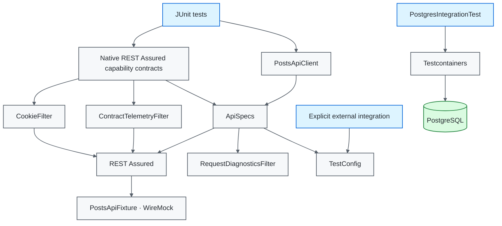

# Java / REST Assured Quality Engineering Framework

[](https://github.com/portyu9/qa-automation-java-restassured/actions/workflows/ci.yml)
[](https://github.com/portyu9/qa-automation-java-restassured/actions/workflows/extended.yml)
[](https://github.com/portyu9/qa-automation-java-restassured/actions/workflows/security.yml)
[](https://github.com/portyu9/qa-automation-java-restassured/actions/workflows/docs.yml)

[](https://www.java.com/)
[](https://maven.apache.org/)
[](https://rest-assured.io/)
[](https://junit.org/junit5/)
[](https://hamcrest.org/)
[](https://json-schema.org/)
[](https://wiremock.org/)
[](https://testcontainers.com/)
[](https://www.postgresql.org/)
[](https://www.docker.com/)
[](https://github.com/features/actions)
[](https://trivy.dev/)
[](LICENSE)
[](.github/SECURITY.md)

A Java API and persistence quality-engineering framework using **REST Assured, JUnit 5, Hamcrest, JSON Schema, WireMock, Testcontainers, PostgreSQL, and Maven**. The design keeps protocol semantics, structural contracts, business semantics, stateful HTTP behavior, persistence integration, runtime compatibility, and repository security as independently attributable verification planes.

> [!IMPORTANT]
> Required API CI is repository-owned. REST Assured exercises real HTTP behavior against dynamic-port WireMock fixtures; deployed APIs are explicit integration targets through `TEST_BASE_URL`, never a hidden prerequisite for framework correctness.

**Read by intent:** [capabilities](#capability-map) · [architecture](#architecture) · [Maven lifecycle](#maven-lifecycle-and-boundaries) · [API depth](#api-assertion-depth) · [protocol composition](#protocol-composition-state-and-telemetry) · [PostgreSQL](#postgresql-integration-boundary) · [dependencies](#dependency-maintenance) · [triage](#failure-triage)

## Capability map

| Plane | What it proves | Boundary | Evidence |
| --- | --- | --- | --- |
| Fast API | Protocol + schema + semantic behavior | REST Assured + dynamic WireMock | Surefire reports |
| Protocol composition | Path/query parameters, specs, extraction, cookies, bounded telemetry | Native REST Assured filters/specs | JUnit/Surefire |
| HTTP contract | Shared headers/correlation/error visibility | WireMock dynamic port | JUnit/Surefire |
| External API | Provider/environment behavior | Explicit `TEST_BASE_URL` | Intentional integration signal |
| Persistence | PostgreSQL driver/schema/transaction behavior | Testcontainers 2 + PostgreSQL 16.15 | Failsafe reports |
| Compatibility | Runtime/toolchain compatibility | Java 17 + 21 + 25; Maven 3.9.16 Wrapper | Matrix reports |
| Security | Source, dependency-change, dependency/configuration, and secret exposure | CodeQL + Dependency Review + Trivy | Code scanning + workflow evidence |
| Documentation | README/workflow/governance consistency | Repository-local validator | Actions status |

## Architecture



## Engineering invariants

| Concern | Framework contract |
| --- | --- |
| Required API target | Fast tests use repository-owned dynamic-port WireMock. |
| External integration | `TestConfig.fromEnvironment()` requires explicit `TEST_BASE_URL`; no public fallback. |
| Request policy | Base URI, JSON Accept, run ID, timeouts, and diagnostics are composed once in `ApiSpecs`. |
| Native protocol surface | Query/path parameters, filters, response specs, extraction, cookies, and Hamcrest remain visible to tests. |
| Correlation | Every request carries run and request identifiers. |
| Failure diagnostics | `RequestDiagnosticsFilter` emits bounded failure/transport metadata. |
| Protocol telemetry | `ContractTelemetryFilter` records method, sanitized path, status, and duration without bodies/query/cookies/credentials. |
| Stateful HTTP | REST Assured `CookieFilter` is scoped to scenarios that intentionally require cookie persistence. |
| Assertion depth | Protocol, structure, semantics, and error behavior are independent contracts. |
| HTTP simulation | WireMock is used where transport-visible behavior is material—not as a universal mock. |
| Persistence | Testcontainers 2 owns the PostgreSQL integration boundary; the fixture image is explicitly pinned to `postgres:16.15-alpine`. |
| Lifecycle | Surefire owns fast tests; Failsafe owns `*IntegrationTest`. |
| Build toolchain | Wrapper 3.3.4 downloads Maven 3.9.16 only after validating the pinned distribution SHA-256. |
| Compatibility | Java 17 baseline, Java 21 previous-LTS, and Java 25 current-LTS fast qualification; full lifecycle on Java 17 and 25. |
| CI safety | Read-only default permissions, least-privilege security-job permissions, concurrency cancellation, bounded jobs. |

## Boundary decision guide

| Requirement | Preferred boundary | Why |
| --- | --- | --- |
| Request/response protocol | REST Assured + WireMock | Real HTTP semantics |
| Path/query/header/body composition | Native REST Assured request/response DSL | Preserve library semantics |
| Response structure | JSON Schema | Version-controlled compatibility |
| Business-critical values | Hamcrest/REST Assured assertions | Semantic correctness |
| Stateful cookie/session behavior | Scoped `CookieFilter` | State is explicit and locally owned |
| Header/correlation behavior | Local HTTP contract | Transport-visible policy |
| Bounded request observations | `ContractTelemetryFilter` | Diagnostic evidence without payload retention |
| SQL dialect/driver/transaction behavior | Testcontainers PostgreSQL | Real DB semantics matter |
| Provider deployment behavior | Explicit external run | Environment remains separately attributable |

## Repository map

```text
.
├── .github/
│   ├── scripts/
│   └── workflows/
├── .mvn/
│   └── wrapper/
├── docs/
└── src/
    └── test/
        ├── java/
        │   └── com/
        │       └── example/
        │           ├── api/
        │           ├── db/
        │           ├── framework/
        │           └── testing/
        └── resources/
```

## Quick start

Prerequisites: Java 17+ and a Docker-compatible runtime for PostgreSQL integration verification. The checked-in Maven Wrapper downloads Maven 3.9.16 on first use and validates the distribution against the repository-pinned SHA-256 before installation; a separately installed Maven is not required.

```bash
# fast deterministic API gate
./mvnw -B -ntp -Pfast test

# complete Maven lifecycle
./mvnw -B -ntp verify

# documentation contract
python .github/scripts/validate_readme.py
```

On Windows, use `mvnw.cmd` in place of `./mvnw`.

Explicit deployed API integration:

```bash
TEST_BASE_URL=https://api.test.example.internal ./mvnw -B -ntp test
```

<details>
<summary><strong>Maven lifecycle reference</strong></summary>

| Invocation | Primary scope |
| --- | --- |
| `./mvnw -B -ntp -Pfast test` | Deterministic Surefire API/framework/WireMock tests. |
| `./mvnw -B -ntp test` | Standard Surefire fast tests. |
| `./mvnw -B -ntp verify` | Surefire + Failsafe integration lifecycle. |

</details>

## Runtime configuration

| Variable | Purpose | Default |
| --- | --- | --- |
| `TEST_BASE_URL` | External API base URI | required for environment-driven integration |
| `TEST_CONNECT_TIMEOUT_MS` | Connection budget | `5000` |
| `TEST_READ_TIMEOUT_MS` | Socket/read budget | `15000` |
| `TEST_RUN_ID` | Run correlation | generated UUID |

The external base URI must be absolute HTTP(S), have a hostname, and contain no credentials, query string, or fragment. Timeout values must be positive.

## Maven lifecycle and boundaries

Maven is not merely a command launcher; its lifecycle is part of test architecture. Surefire and Failsafe separate fast verification from integration verification, while Enforcer rejects unsupported Java/Maven environments before meaningful test work begins. Repository and CI execution use the checksum-pinned Maven Wrapper so the Maven executable itself is version-controlled policy rather than an ambient runner dependency.

CI treats runtime qualification as separate evidence: Java 17 remains the minimum supported baseline, Java 21 preserves previous-LTS compatibility, and Java 25 exercises the current LTS. Fast deterministic contracts run on all three. Full `verify` runs on Java 17 in primary CI and Java 25 in extended CI so both ends of the supported runtime policy execute the PostgreSQL integration boundary.

Do not replace first-class lifecycle ownership with ad-hoc shell filtering. A test's name and phase communicate expected infrastructure cost and failure domain.

## Shared request policy

`ApiSpecs.request(config)` composes validated URI, `Accept: application/json`, `X-Test-Run-Id`, request IDs, transport budgets, and failure diagnostics. Endpoint operations remain explicit in `PostsApiClient`; native REST Assured `Response` objects stay visible to tests.

The abstraction is policy—not a second HTTP language.

## API assertion depth

A meaningful API test can prove several independent dimensions:

1. **Protocol** — status and content type.
2. **Structure** — JSON Schema.
3. **Semantics** — identifiers and business-critical values.
4. **Boundary behavior** — invalid/error responses.
5. **Side effects** — persistence/events when mutation matters.

A schema-valid response can still represent the wrong resource. A `200` can still be semantically wrong. Treat these contracts as complementary, not interchangeable.

## Protocol composition, state, and telemetry

`RestAssuredCapabilitiesTest` demonstrates that framework policy composes with REST Assured rather than replacing it:

- `queryParam()` and `pathParam()` build request identity through native request semantics;
- shared request/response specifications remain reusable while endpoint-specific status/header/body assertions stay local;
- `.extract().path(...)` retains native response extraction for downstream scenario logic;
- `CookieFilter` carries intentionally scoped server state across related requests;
- `ContractTelemetryFilter` records a concurrent-safe observation of method, URL **path only**, status, and elapsed milliseconds.

`RequestDiagnosticsFilter` and `ContractTelemetryFilter` solve different problems. Diagnostics explain failed/transport requests; telemetry demonstrates bounded protocol observations. Neither retains request/response bodies, authorization values, query strings, or cookies.

> [!IMPORTANT]
> Shared filters are cross-cutting policy and therefore deserve stricter data-minimization rules than an individual test assertion. A test may inspect a response body to prove behavior without making that payload suitable for global logging.

## Deterministic HTTP boundary with WireMock

`PostsApiFixture` owns a dynamic-port server. Tests execute the normal `PostsApiClient`/REST Assured path against that fixture and verify headers, correlation, JSON behavior, schemas, semantics, stateful protocol behavior, and visible error responses.

WireMock stubs the **service boundary**, not REST Assured itself. This preserves serialization, header, status, request-specification, filter, and extraction behavior while removing public-network availability from required CI.

## PostgreSQL integration boundary

`PostgresIntegrationTest` belongs to Failsafe and provisions real PostgreSQL only when SQL dialect, driver, schema, or transaction semantics are material. The integration module uses the Testcontainers 2 PostgreSQL coordinate/namespace and an explicit `postgres:16.15-alpine` image so a future mutable `16-alpine` tag cannot silently change the database minor during an otherwise unchanged framework run.

> [!TIP]
> A container is not a realism badge. It is justified when real external-system semantics are part of the requirement and should be omitted when they are not.

## Evidence, CI, and security

Primary CI runs deterministic API/framework tests across Java 17/21/25 and full verification on Java 17 through the checksum-pinned Maven Wrapper. Extended CI runs the complete Java 25 lifecycle, including the Testcontainers/PostgreSQL boundary. Security and documentation gates remain independent.

Security is intentionally layered rather than represented by one scanner. CodeQL analyzes Java source with the extended security query suite; pull-request Dependency Review performs change-aware dependency analysis when GitHub Dependency graph data is available; Trivy independently scans the repository filesystem for fixed HIGH/CRITICAL dependency findings, supported HIGH/CRITICAL misconfiguration findings, and committed-secret findings. When Dependency graph is unavailable, the workflow states that the diff-aware control did not run instead of treating Trivy as equivalent.

Failure diagnostics and protocol telemetry are deliberately bounded. Bodies, authorization values, cookies, full URLs, and query strings are excluded from automatic shared evidence.

## Dependency maintenance

Dependabot maintains **Maven** and **GitHub Actions** dependencies. Maven execution itself is pinned separately through Wrapper 3.3.4, Maven 3.9.16, and a checked distribution SHA-256.

- weekly Monday 09:00 America/New_York;
- minor/patch updates grouped for efficient review;
- major upgrades remain standalone so Java/JUnit/REST Assured/WireMock/Testcontainers compatibility changes are attributable;
- GitHub Actions are reviewed as executable dependencies;
- Maven-wrapper changes require an intentional version/checksum update and full lifecycle verification;
- dependency PRs must clear Enforcer, compile, Surefire/Failsafe, compatibility, security, and docs gates as applicable.

Dependabot proposes updates for dependencies whose package coordinates remain stable. Ecosystem migrations that rename coordinates or Java packages—such as the Testcontainers 2 PostgreSQL module move to `org.testcontainers:testcontainers-postgresql` and `org.testcontainers.postgresql`—require an intentional migration with compilation and integration evidence rather than pretending an absent bot PR means the old major is current. Maven lifecycle evidence and release-impact review decide mergeability.

## Failure triage

| Signal | First interpretation |
| --- | --- |
| Wrapper/checksum | Maven toolchain provenance/download integrity |
| Enforcer/compile | Toolchain/build configuration |
| WireMock startup | Local HTTP fixture lifecycle |
| Protocol assertion | HTTP behavior |
| Query/path/extraction mismatch | Request/response composition |
| Cookie-state mismatch | Explicit stateful HTTP contract |
| Telemetry mismatch | Filter observation/sanitization policy |
| Schema failure | Structural compatibility |
| Semantic failure | Wrong resource/business value |
| Header/correlation failure | Shared request policy |
| Testcontainers startup | Docker/container integration infrastructure |
| PostgreSQL assertion | DB integration semantics |
| Java-version-only failure | Runtime compatibility |
| External-target-only failure | Environment/provider integration |
| CodeQL | Source-level security query finding or analysis/build failure |
| Dependency Review | Newly introduced dependency risk or unavailable dependency-graph service |
| Trivy | Repository dependency/configuration/secret exposure |
| Docs | Documentation/governance contract |

## Explicit anti-patterns

- required CI against a public API;
- bypassing the checked-in Maven Wrapper with an ambient Maven executable in repository automation;
- removing distribution checksum validation when changing the Maven toolchain;
- wrapping REST Assured until native response semantics disappear;
- global cookie/session filters shared across unrelated tests;
- schema validation as the only correctness assertion;
- static/shared ports for deterministic fixtures;
- Testcontainers where database semantics are irrelevant;
- floating container tags where database-version changes should remain attributable;
- arbitrary body/auth/query/cookie logging in shared filters;
- mixing integration tests into the fast phase through shell filtering;
- expanding retries to hide provider or infrastructure failures.

## Design references

- [`docs/ARCHITECTURE.md`](docs/ARCHITECTURE.md) — configuration, request policy, WireMock, persistence, lifecycle, and evidence boundaries.
- [`docs/TEST_STRATEGY.md`](docs/TEST_STRATEGY.md) — assertion depth, test layers, compatibility, integration, and exit criteria.
- [`CONTRIBUTING.md`](CONTRIBUTING.md) — change-quality expectations.

A strong REST Assured framework makes the failing boundary obvious: **build/runtime policy, HTTP protocol/composition/state, schema, semantics, transport policy, persistence integration, compatibility, security control, or explicit provider environment**.
