# Java / REST Assured Quality Engineering Framework

[](https://github.com/portyu9/qa-automation-java-restassured/actions/workflows/ci.yml)
[](https://github.com/portyu9/qa-automation-java-restassured/actions/workflows/extended.yml)
[](https://github.com/portyu9/qa-automation-java-restassured/actions/workflows/security.yml)
[](https://github.com/portyu9/qa-automation-java-restassured/actions/workflows/docs.yml)

[](https://www.java.com/)
[](https://maven.apache.org/)
[](https://rest-assured.io/)
[](https://junit.org/)
[](https://hamcrest.org/)
[](https://json-schema.org/)
[](https://wiremock.org/)
[](https://testcontainers.com/)
[](https://www.postgresql.org/)
[](https://www.docker.com/)
[](https://github.com/features/actions)
[](https://trivy.dev/)
[](LICENSE)
[](.github/SECURITY.md)

A Java API and persistence quality-engineering framework using **REST Assured, JUnit, Hamcrest, JSON Schema, WireMock, Testcontainers, PostgreSQL, and Maven**. Protocol behavior, semantic correctness, stateful HTTP, persistence, runtime compatibility, evidence integrity, and security remain independently attributable.

> [!IMPORTANT]
> Required API verification is deterministic and repository-owned: REST Assured uses dynamic-port WireMock, PostgreSQL integration uses the tracked Testcontainers image, and deployed APIs are explicit `TEST_BASE_URL` integrations rather than hidden prerequisites.

**Start here:** [capabilities](#capabilities) · [architecture](#architecture) · [quick-start](#quick-start) · [repository-map](#repository-map) · [documentation](#documentation)

## Capabilities

| Plane | Purpose | Primary evidence |
| --- | --- | --- |
| Fast API | Protocol, schema, semantic, negative, and stateful HTTP behavior | Surefire + dynamic WireMock |
| Native REST Assured | Params, specs, filters, extraction, cookies, Hamcrest, bounded telemetry | JUnit/Surefire |
| Persistence | JDBC/PostgreSQL dialect, generated identity, owned data lifecycle | Failsafe + Testcontainers |
| Runtime compatibility | Qualified Java/Maven execution envelope | Maven Wrapper + CI matrix |
| Evidence integrity | Intended suites executed with zero failures/errors/skips | Repository-owned XML validation |
| Security | Source, resolved test dependencies, hardened DB image, repository, dependency-diff risk | CodeQL, CycloneDX/Trivy, Dependency Review |
| Documentation | README/workflow/governance consistency | Documentation contract status |

## Architecture

```mermaid
flowchart LR
    CHANGE[Repository change] --> TEST[JUnit + REST Assured]
    TEST --> SPEC[ApiSpecs policy]
    SPEC --> RA[REST Assured]
    RA --> WM[Dynamic WireMock fixture]

    CHANGE --> DB[PostgresIntegrationTest]
    DB --> TC[Testcontainers]
    TC --> PG[qa-restassured-postgres:16.15-hardened]

    WM --> SURE[Surefire evidence]
    PG --> FAIL[Failsafe evidence]
    SURE --> VALIDATE[Semantic evidence validator]
    FAIL --> VALIDATE
    VALIDATE --> GATES[CI gates]
    GATES --> RESULT[Qualified repository change]

    classDef entry fill:#DDF4FF,stroke:#0969DA,color:#24292F,stroke-width:1.5px;
    classDef policy fill:#FBEFFF,stroke:#8250DF,color:#24292F,stroke-width:1.5px;
    classDef runtime fill:#FFF8C5,stroke:#9A6700,color:#24292F,stroke-width:1.5px;
    classDef evidence fill:#DAFBE1,stroke:#1A7F37,color:#24292F,stroke-width:1.5px;
    class CHANGE entry;
    class TEST,SPEC policy;
    class RA,WM,DB,TC,PG runtime;
    class SURE,FAIL,VALIDATE,GATES,RESULT evidence;
    linkStyle default stroke:#57606A,stroke-width:1.4px;
```



REST Assured remains the visible HTTP DSL; WireMock owns deterministic provider conditions; Testcontainers is introduced only where PostgreSQL semantics are material; Maven lifecycle and evidence validation keep fast and infrastructure-bearing failures separate. See [`docs/ARCHITECTURE.md`](docs/ARCHITECTURE.md).

## Quick start

The **minimum supported Java** runtime and the **current qualified Java** runtime are explicitly qualified by CI. The checked-in **Maven Wrapper** pins and checksum-validates the repository-qualified Maven distribution.

```bash
# deterministic API/framework contracts
./mvnw -B -ntp -Pfast test

# full API + PostgreSQL lifecycle
./mvnw -B -ntp verify
```

On Windows use `mvnw.cmd`.

Explicit deployed-provider integration:

```bash
TEST_BASE_URL=https://api.test.example.internal ./mvnw -B -ntp test
```

For runtime variables, Maven lifecycle policy, native REST Assured capabilities, assertion depth, PostgreSQL details, evidence semantics, security, dependencies, and triage, see [`docs/OPERATIONS.md`](docs/OPERATIONS.md).

## Repository map

```text
.
├── .github/
├── .mvn/
├── docker/
├── docs/
└── src/
```

## Engineering contracts

- **Deterministic API target:** required fast tests execute real HTTP against dynamic-port WireMock rather than a public API.
- **Native library semantics:** params, filters, specs, extraction, cookies, Hamcrest, and REST Assured responses stay visible.
- **Explicit environment integration:** external `TEST_BASE_URL` is never a fallback definition of framework health.
- **Lifecycle ownership:** Surefire owns fast contracts; Failsafe owns PostgreSQL integration.
- **Real persistence only when material:** PostgreSQL is used when JDBC/dialect/identity/query semantics are the requirement.
- **Bounded diagnostics:** automatic filters retain structural metadata, not bodies, credentials, cookies, or query strings.
- **Semantic evidence:** Maven success alone is insufficient; XML evidence must prove the expected tests actually executed without skips.
- **Qualified toolchain:** support claims are bounded by explicit Java/Maven CI qualification rather than open-ended version parsing.

## Hardened PostgreSQL runtime

Persistence integration builds the repository-owned `qa-restassured-postgres:16.15-hardened` image from [`docker/postgres-test.Dockerfile`](docker/postgres-test.Dockerfile). Its provenance, patched runtime floor, and final non-root user are governed independently from the Java dependency graph.

The **PostgreSQL Testcontainers image gate** rebuilds and scans that exact tracked image independently. This prevents a successful database test from masking a vulnerable test-runtime image.

The currently qualified Testcontainers major remains deliberate; a future-major migration must prove Docker-client initialization, module/package compatibility, PostgreSQL lifecycle, supported-Java behavior, and dependency/security evidence—not merely compilation.

## Stable CI conclusions

| Stable status | Responsibility |
| --- | --- |
| `ci-gate` | Qualified fast-runtime coverage plus current-runtime full verification |
| `extended-gate` | Minimum-supported-Java full lifecycle including PostgreSQL |
| `security-gate` | CodeQL, resolved test-dependency/SBOM scanning, PostgreSQL image scanning, repository policy, Dependency Review when available |

Workflow definitions: [`ci.yml`](.github/workflows/ci.yml) · [`extended.yml`](.github/workflows/extended.yml) · [`security.yml`](.github/workflows/security.yml) · [`docs.yml`](.github/workflows/docs.yml).

## Documentation

| Guide | Use it for |
| --- | --- |
| [`docs/ARCHITECTURE.md`](docs/ARCHITECTURE.md) | Config/request policy, native REST Assured, WireMock, PostgreSQL, Maven lifecycle, evidence/security boundaries |
| [`docs/TEST_STRATEGY.md`](docs/TEST_STRATEGY.md) | Layer selection, runtime qualification, lifecycle ownership, exit criteria |
| [`docs/OPERATIONS.md`](docs/OPERATIONS.md) | Commands, runtime config, Maven policy, API assertions, PostgreSQL, evidence, security, dependencies, triage |
| [`CONTRIBUTING.md`](CONTRIBUTING.md) | Change-quality expectations |
| [Security policy](.github/SECURITY.md) | Disclosure and repository security policy |

The deeper protocol, persistence, runtime, evidence, and security detail lives in `/docs`; the main README intentionally retains only the architecture overview above.

## Design principle

Use **real infrastructure when infrastructure semantics are the requirement**, not merely to make a test look more integrated. A strong REST Assured framework makes the failed boundary obvious: **configuration, HTTP policy, structure, semantics, stateful protocol behavior, runtime compatibility, persistence integration, evidence integrity, supply chain, or explicit environment integration**.
