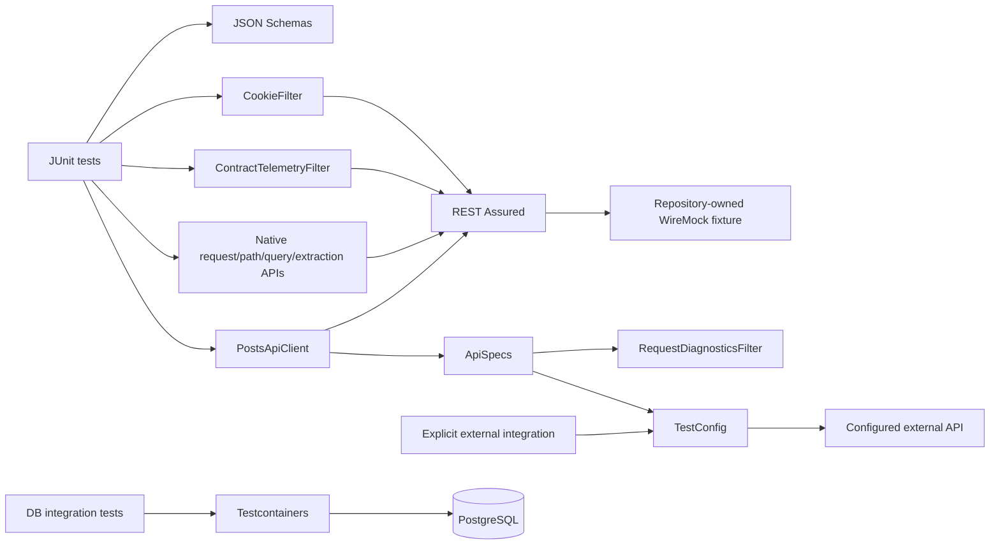

# Architecture

## Design objective

The framework keeps REST Assured fluent request/assertion APIs visible while centralizing shared request policy, validated runtime configuration, request correlation, schema artifacts, deterministic HTTP fixture ownership, bounded structural telemetry, and integration-test lifecycle.

Framework code should add domain or cross-cutting policy, not wrap every REST Assured operation in a second generic API.

## Deterministic HTTP target model

Required Maven and GitHub Actions validation does not depend on a public API. `PostsApiFixture` owns a dynamic-port loopback `WireMockServer` and provides the `TestConfig` consumed by REST Assured acceptance tests.

The fixture defines only the HTTP behavior required to prove the client/framework contract. REST Assured still performs real HTTP requests; JSON Schema and semantic assertions remain in the tests. WireMock supplies deterministic transport availability, not a substitute assertion engine.

Dynamic ports avoid fixed-port contention across parallel jobs and local processes. Each test owns and closes its fixture explicitly.

Environment-driven execution is a separate integration path. `TestConfig.fromEnvironment()` requires `TEST_BASE_URL`; there is no silent public fallback. A missing target is therefore a configuration error before transport rather than an accidental request to a third-party service.

## Configuration invariants

`TestConfig` is an immutable Java record whose compact constructor enforces invariants for every construction path, not only `fromEnvironment()`.

The base URI must:

- be non-null and absolute;
- use HTTP or HTTPS;
- contain a hostname;
- use an explicit port only within 1–65535;
- contain no URL user-info/credentials;
- contain no query string or fragment;
- retain optional path prefixes.

Connect/read timeouts must be positive. Run IDs are trimmed and must be 1–128 ASCII letters, digits, dots, underscores, colons, or hyphens because they become request-correlation metadata.

Because constructor validation is universal, test code cannot bypass policy by manually instantiating `TestConfig`.

The environment loader accepts a read-only lookup function for contract tests. This allows missing/invalid external-target behavior to be proved without mutating process-global environment state.

## Shared request policy

`ApiSpecs.request(config)` creates the shared `RequestSpecification`:

- validated base URI;
- JSON accept policy;
- run-level `X-Test-Run-Id` correlation;
- bounded connect/socket timeout settings;
- `RequestDiagnosticsFilter`.

`ApiSpecs.jsonResponse()` contains only response policy that truly applies broadly. Endpoint-specific status and semantic assertions stay with tests/client flows.

## Native protocol composition

Capability tests intentionally keep REST Assured's own request/response model visible. They prove that the shared specification composes with:

- query parameters;
- path parameters;
- response-header assertions;
- body assertions;
- response extraction;
- custom filters;
- scoped `CookieFilter` state.

The framework does not replace these APIs with an internal request DSL. New helpers are justified only when they enforce a durable cross-cutting invariant.

## Run-level vs request-level correlation

Two identifiers have different purposes:

- `X-Test-Run-Id` groups all requests produced by one test execution;
- `X-Test-Request-Id` is generated by `RequestDiagnosticsFilter` for each individual HTTP exchange.

Keeping these separate makes one slow/failing call traceable inside a larger run without overloading a single identifier.

## Failure diagnostics vs contract telemetry

`RequestDiagnosticsFilter` and `ContractTelemetryFilter` have deliberately different jobs.

### Request diagnostics

`RequestDiagnosticsFilter` is installed through the shared request specification and emits failure-focused structural context. For HTTP failures it records only bounded method/status/duration/request-correlation information. For transport exceptions it records exception class and duration.

Request/response bodies, authorization headers, cookies, raw URLs, and query strings are intentionally not automatically logged.

### Contract telemetry

`ContractTelemetryFilter` is an opt-in native REST Assured filter for tests that need execution observations. It retains only:

- method;
- sanitized URI path;
- status code;
- duration.

The in-memory observation window is bounded: the default retains at most 1,000 recent observations, and callers can choose a smaller positive capacity. When full, the oldest observation is discarded. Snapshot reads return immutable copies under synchronization.

This prevents a long or data-driven suite from turning a structural telemetry helper into unbounded process memory while preserving thread-safe recent evidence.

## Stateful HTTP behavior

`CookieFilter` is created by the test/flow that owns the session state. It is never installed as a global singleton. This makes cookie replay explicit and prevents authentication/session state from leaking between unrelated tests.

## Client boundary

`PostsApiClient` exposes domain-oriented operations such as list/get post. It is provider-neutral: target ownership belongs to `TestConfig`, not to the client class name or implementation. The client applies the shared request specification and returns REST Assured responses for expressive test assertions.

Its no-argument constructor is intentionally environment-driven and therefore suitable only when an external target has been explicitly configured. Deterministic tests inject `TestConfig` from `PostsApiFixture`.

Input validation that belongs to the client operation—such as positive resource IDs—happens before sending a request.

## Schema ownership

Collection and single-resource responses use separate JSON Schema artifacts. This avoids applying an array schema to an item response and makes contract intent explicit.

Schema assertions are paired with semantic assertions. Shape validation cannot prove that the returned `id` matches the requested resource.

## Maven lifecycle

Surefire owns fast `*Test` execution and excludes `*IntegrationTest`. Failsafe owns integration tests during `verify`.

This creates a predictable split:

- `mvn test` / fast profile → framework/API/WireMock fast tests;
- `mvn verify` → full lifecycle including PostgreSQL integration.

Maven Enforcer establishes Java/Maven runtime floors before test execution. CI jobs are additionally bounded by GitHub Actions timeouts so a stuck container/network dependency cannot consume runner capacity indefinitely.

## Database integration

Database integration tests use isolated Testcontainers PostgreSQL infrastructure where real dialect, schema, transaction, or JDBC behavior is material. Container lifecycle belongs to the integration layer, not shared API fast tests. Integration failures remain distinguishable from REST/API assertion failures through Maven's Surefire/Failsafe reports.

## Failure-domain separation

| Failure | First owner |
| --- | --- |
| Missing/unsafe `TEST_BASE_URL` or run correlation | Configuration |
| WireMock startup/stub mismatch | Deterministic HTTP fixture |
| REST Assured transport/filter failure | HTTP framework boundary |
| Cookie/state mismatch | Test-owned session state |
| Telemetry capacity/observation mismatch | Structural telemetry helper |
| Status/schema/semantic mismatch | API contract |
| PostgreSQL container/runtime failure | Integration infrastructure |
| SQL/transaction assertion | Persistence contract |

## Extension rules

New framework behavior should:

1. keep required CI on repository-owned deterministic targets;
2. place invariants in constructors/configuration boundaries when all callers must obey them;
3. keep shared request policy in `ApiSpecs`;
4. use REST Assured filters only for genuine cross-cutting behavior;
5. bound any retained filter state and keep automatic diagnostics payload-safe;
6. scope cookie/session filters to the owning test flow;
7. store schemas as version-controlled test resources;
8. pair schemas with semantic assertions;
9. preserve Surefire/Failsafe separation;
10. require explicit configuration for external API integration;
11. add framework-contract tests for new configuration/policy invariants.
