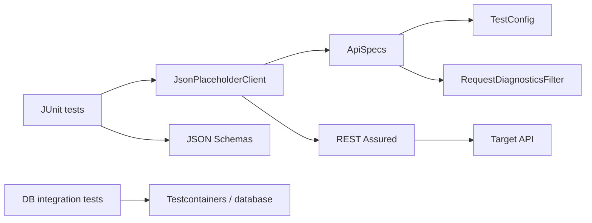

# Architecture

## Design objective

The framework keeps REST Assured fluent request/assertion APIs visible while centralizing shared request policy, validated runtime configuration, request correlation, schema artifacts, and integration-test lifecycle.

Framework code should add domain or cross-cutting policy, not wrap every REST Assured operation in a second generic API.

## Configuration invariants

`TestConfig` is an immutable Java record whose **compact constructor** enforces invariants for every construction path, not only `fromEnvironment()`.

The base URI must:

- be non-null and absolute;
- use HTTP or HTTPS;
- contain a hostname;
- contain no URL user-info/credentials;
- contain no query string or fragment;
- retain optional path prefixes.

Connect/read timeouts must be positive and run ID must be nonblank. Because constructor validation is universal, test code cannot bypass policy by manually instantiating `TestConfig`.

## Shared request policy

`ApiSpecs.request(config)` creates the shared `RequestSpecification`:

- validated base URI;
- JSON accept policy;
- run-level `X-Test-Run-Id` correlation;
- bounded connect/socket timeout settings;
- `RequestDiagnosticsFilter`.

`ApiSpecs.jsonResponse()` contains only response policy that truly applies broadly. Endpoint-specific status and semantic assertions stay with tests/client flows.

## Run-level vs request-level correlation

Two identifiers have different purposes:

- `X-Test-Run-Id` groups all requests produced by one test execution;
- `X-Test-Request-Id` is generated by `RequestDiagnosticsFilter` for each individual HTTP exchange.

Keeping these separate makes one slow/failing call traceable inside a larger run without overloading a single identifier.

## Request diagnostics

`RequestDiagnosticsFilter` is a native REST Assured filter. It observes transport/response behavior without changing request semantics.

For HTTP failures it emits only bounded structural information:

- request correlation ID;
- method;
- status;
- duration.

For transport exceptions it emits correlation ID, method, exception class, and duration. Request/response bodies, authorization headers, cookies, and URLs are intentionally not automatically logged.

This is a privacy-first default. A test can add targeted domain evidence when required, but broad payload dumping should not be enabled globally.

## Client boundary

`JsonPlaceholderClient` exposes domain-oriented operations such as list/get post. It applies the shared request specification and returns REST Assured responses for expressive test assertions.

Input validation that belongs to the client operation—such as positive resource IDs—happens before sending a request.

## Schema ownership

Collection and single-resource responses use separate JSON Schema artifacts. This avoids applying an array schema to an item response and makes contract intent explicit.

Schema assertions are paired with semantic assertions. Shape validation cannot prove that the returned `id` matches the requested resource.

## Maven lifecycle

Surefire owns fast `*Test` execution and excludes `*IntegrationTest`. Failsafe owns integration tests during `verify`.

This creates a predictable split:

- `mvn test` / fast profile → framework/API fast tests;
- `mvn verify` → full lifecycle including integrations.

Maven Enforcer establishes Java/Maven runtime floors before test execution.

## Database integration

Database integration tests use isolated containerized infrastructure where configured. Container lifecycle belongs to the integration layer, not shared API unit tests. Integration failures should be distinguishable from REST/API assertion failures through Maven's Surefire/Failsafe reports.

## Extension rules

New framework behavior should:

1. place invariants in constructors/configuration boundaries when all callers must obey them;
2. keep shared request policy in `ApiSpecs`;
3. use REST Assured filters only for genuine cross-cutting behavior;
4. keep automatic diagnostics structural and payload-safe;
5. store schemas as version-controlled test resources;
6. pair schemas with semantic assertions;
7. preserve Surefire/Failsafe separation;
8. add framework-contract tests for new configuration/policy invariants.
