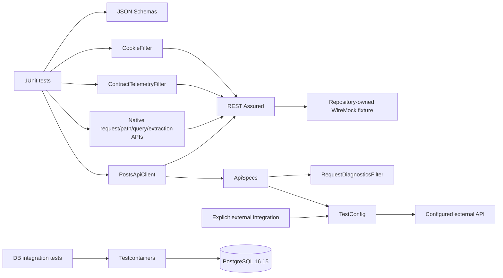

# Architecture

## Design objective

The framework keeps REST Assured fluent request/assertion APIs visible while centralizing shared request policy, validated runtime configuration, request correlation, schema artifacts, deterministic HTTP fixture ownership, bounded structural telemetry, and integration-test lifecycle.

Framework code should add domain or cross-cutting policy, not wrap every REST Assured operation in a second generic API.

## Deterministic HTTP target model

Required Maven and GitHub Actions validation does not depend on a public API. `PostsApiFixture` owns a dynamic-port loopback `WireMockServer` and provides the `TestConfig` consumed by REST Assured acceptance tests.

The fixture defines only the HTTP behavior required to prove the client/framework contract. REST Assured still performs real HTTP requests; JSON Schema and semantic assertions remain in the tests. WireMock supplies deterministic transport availability, not a substitute assertion engine.

Dynamic ports avoid fixed-port contention across parallel jobs and local processes. Each test owns and closes its fixture explicitly.

Environment-driven execution is a separate integration path. `TestConfig.fromEnvironment()` requires `TEST_BASE_URL`; there is no silent public fallback. A missing target is therefore a configuration error before transport rather than an accidental request to a third-party service.

## Configuration invariants

`TestConfig` is an immutable Java record whose compact constructor enforces invariants for every construction path, not only `fromEnvironment()`.

The base URI must be non-null and absolute, use HTTP or HTTPS, contain a hostname, use an explicit port only within 1–65535, contain no URL credentials/query/fragment, and retain optional path prefixes. Connect/read timeouts must be positive. Run IDs are trimmed and constrained because they become request-correlation metadata.

The environment loader accepts a read-only lookup function for contract tests so negative configuration behavior can be proved without mutating process-global environment state.

## Shared request policy

`ApiSpecs.request(config)` creates the shared `RequestSpecification` with validated base URI, JSON accept policy, run-level correlation, bounded connect/socket timeouts, and `RequestDiagnosticsFilter`. Endpoint-specific status and semantic assertions stay with tests/client flows.

## Native protocol composition

Capability tests intentionally keep REST Assured's own request/response model visible. They prove that the shared specification composes with query/path parameters, response-header/body assertions, response extraction, custom filters, and scoped `CookieFilter` state. New helpers are justified only when they enforce a durable cross-cutting invariant.

## Run-level vs request-level correlation

`X-Test-Run-Id` groups requests produced by one execution; `X-Test-Request-Id` is generated for each HTTP exchange by `RequestDiagnosticsFilter`. Keeping them separate makes one slow/failing call traceable inside a larger run.

## Failure diagnostics vs contract telemetry

`RequestDiagnosticsFilter` emits failure-focused structural context only. Request/response bodies, authorization headers, cookies, raw URLs, and query strings are intentionally not automatically logged.

`ContractTelemetryFilter` is opt-in and retains only method, sanitized URI path, status code, and duration. Its recent-observation window is bounded and synchronized, preventing a long or data-driven suite from turning structural telemetry into an unbounded memory sink.

## Stateful HTTP behavior

`CookieFilter` is created by the test/flow that owns session state and is never installed as a global singleton. This makes cookie replay explicit and prevents authentication/session state from leaking between unrelated tests.

## Client boundary

`PostsApiClient` exposes domain-oriented operations while target ownership remains in `TestConfig`. Native REST Assured `Response` objects remain visible for expressive assertions. Operation-specific input validation happens before transport.

## Schema ownership

Collection and single-resource responses use separate JSON Schema artifacts. Schema assertions are paired with semantic assertions because structural validity cannot prove resource identity or business correctness.

## Maven lifecycle and runtime policy

Surefire owns fast `*Test` execution and excludes `*IntegrationTest`; Failsafe owns integration tests during `verify`. Maven Enforcer establishes Java/Maven runtime floors before test execution.

CI qualifies Java 17 as the supported baseline, Java 21 as previous-LTS compatibility, and Java 25 as current-LTS compatibility. Fast deterministic contracts execute on all three; full integration lifecycle coverage executes on Java 17 and Java 25. Jobs are additionally bounded by GitHub Actions timeouts.

## Database integration

Database integration tests use isolated Testcontainers PostgreSQL infrastructure where real dialect, schema, transaction, or JDBC behavior is material. The database image is explicitly pinned to `postgres:16.15-alpine` so a PostgreSQL minor change remains attributable to a repository change.

The accepted integration-library line remains Testcontainers 1.21.4. An attempted 2.0.5 migration compiled on all qualified Java runtimes but failed at Docker-client initialization because the assembled runtime exposed an incompatible Jackson annotation version. The same upstream 2.0.5 release also has reported security concerns in its shaded Jackson layer. A future 2.x migration must therefore clear both assembled-runtime integration tests and upstream dependency-security review; local overrides that merely force the process past initialization are not an acceptable substitute.

The Testcontainers 2 PostgreSQL artifact/package rename also means Dependabot cannot represent this as an ordinary in-place version update. This migration is intentionally owned as an architectural change rather than inferred from an absent bot PR.

## Security boundary

Repository security is deliberately layered:

- CodeQL performs source-level Java analysis with the extended security query suite and an explicit Maven test-compilation build;
- pull-request Dependency Review performs graph-backed change analysis when GitHub Dependency graph data is available;
- Trivy independently scans dependency manifests, supported configuration, and committed secret material at HIGH/CRITICAL policy thresholds.

The Dependency Review availability probe exists because a whole-repository filesystem scanner is not equivalent to change-aware dependency analysis. If graph data is unavailable, that limitation is surfaced explicitly while Trivy remains an independent gate. Security review also considers dependency content hidden by shading or repackaging when manifest scanners cannot see it directly.

## Supply-chain ownership

Dependabot owns ordinary Maven and GitHub Actions update proposals while Maven Wrapper version/checksum policy is repository-owned. Package-coordinate or Java-package migrations that cannot be inferred from the existing dependency identity must be handled explicitly with compilation, integration, and security evidence.

## Failure-domain separation

| Failure | First owner |
| --- | --- |
| Missing/unsafe `TEST_BASE_URL` or run correlation | Configuration |
| WireMock startup/stub mismatch | Deterministic HTTP fixture |
| REST Assured transport/filter failure | HTTP framework boundary |
| Cookie/state mismatch | Test-owned session state |
| Telemetry capacity/observation mismatch | Structural telemetry helper |
| Status/schema/semantic mismatch | API contract |
| PostgreSQL container/runtime failure | Integration infrastructure / assembled dependency runtime |
| SQL/transaction assertion | Persistence contract |
| Java-version-only failure | Runtime compatibility |
| CodeQL analysis/build failure | Source-security boundary |
| Dependency Review finding/unavailability | Dependency-change boundary |
| Trivy finding | Repository dependency/configuration/secret boundary |

## Extension rules

New framework behavior should:

1. keep required CI on repository-owned deterministic targets;
2. place universal invariants in constructor/configuration boundaries;
3. keep shared request policy in `ApiSpecs`;
4. use REST Assured filters only for genuine cross-cutting behavior;
5. bound retained filter state and keep automatic diagnostics payload-safe;
6. scope cookie/session filters to the owning test flow;
7. store schemas as version-controlled test resources and pair them with semantic assertions;
8. preserve Surefire/Failsafe separation;
9. require explicit configuration for external API integration;
10. pin integration-container versions when version changes are materially attributable;
11. treat renamed dependency coordinates/packages as explicit migrations rather than invisible automation gaps;
12. require major integration-library migrations to pass assembled-runtime and security acceptance, not merely compilation;
13. add framework-contract tests for new configuration/policy invariants.
