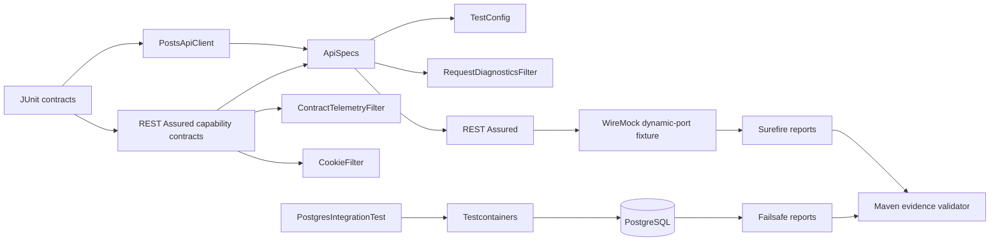

# Architecture

## Design objective

The framework keeps REST Assured native while centralizing the policies that should not be rewritten in every test: validated target configuration, reusable request/response specifications, bounded diagnostics, correlation, deterministic provider fixtures, Maven lifecycle ownership, persistence isolation, runtime qualification, and semantic CI evidence.

The architecture is deliberately layered. A test should fail at the cheapest boundary capable of proving the requirement, and the resulting evidence should make that boundary obvious.

## Configuration boundary

`TestConfig` owns the target URI, connection/read budgets, and run identity. Environment parsing occurs at the edge through `TestConfig.fromEnvironment()`; core tests can construct configuration directly without mutating process-global state.

External targets must:

- use HTTP or HTTPS;
- be absolute and have a hostname;
- contain no embedded credentials;
- contain no query string or fragment;
- reject explicit port `0` or invalid port ranges;
- use positive timeout budgets;
- use bounded correlation identifiers.

Configuration failures happen before request construction. This keeps malformed environment state out of transport-level retry or timeout diagnosis.

## Request-policy boundary

`ApiSpecs.request(config)` centralizes durable cross-cutting HTTP policy:

- base URI;
- JSON `Accept` contract;
- run correlation;
- per-request correlation;
- connection/read budgets;
- bounded failure diagnostics.

This is intentionally narrower than a generic API wrapper. Endpoint-specific paths, parameters, status expectations, schemas, and semantic assertions remain visible in the REST Assured DSL.

## Native REST Assured boundary

`RestAssuredCapabilitiesTest` proves that framework policy composes with the library rather than replacing it. The suite keeps first-class coverage for:

- path and query parameters;
- shared request/response specifications;
- filters;
- extraction;
- `CookieFilter` state;
- status/header/body assertions;
- bounded telemetry.

A framework abstraction is useful when it owns policy. Renaming `given()`, `.get()`, `.then()`, or `.extract()` would add indirection without adding quality.

## Deterministic HTTP boundary

`PostsApiFixture` provisions WireMock on a dynamic loopback port. The normal `PostsApiClient` and REST Assured stack execute real HTTP against that fixture.

This preserves transport-visible behavior—serialization, headers, status, cookies, request specifications, filters, extraction—while excluding public DNS, TLS, third-party data, rate limits, and service availability from required CI.

WireMock is therefore a provider-boundary simulator, not a mock of REST Assured.

## Diagnostics and telemetry

`RequestDiagnosticsFilter` and `ContractTelemetryFilter` have different ownership:

- diagnostics explain a failed/transport request;
- telemetry records a bounded recent window of protocol observations.

Shared evidence is intentionally data-minimized. It can retain method, sanitized path, status, duration, request identity, and error class, but not authorization values, cookies, query strings, or request/response bodies.

An individual test may inspect a body to prove behavior without making that body suitable for automatic global logging.

## Persistence boundary

`PostgresIntegrationTest` is a Failsafe integration contract. It uses Testcontainers only because JDBC/driver/PostgreSQL behavior is material to the requirement.

The integration owns:

- the repository-built `qa-restassured-postgres:16.15-hardened` image from `docker/postgres-test.Dockerfile`;
- an isolated container lifecycle;
- a temporary test-owned table;
- generated identity retrieval;
- parameterized insert/select behavior;
- deterministic cleanup through connection/container lifecycle.

The repository deliberately remains on Testcontainers. The prior major-version migration demonstrated that compile success was insufficient: Docker-client initialization failed because the assembled runtime carried incompatible Jackson annotation behavior, and the future-major module/package coordinates changed. A future migration must prove runtime compatibility, not merely dependency resolution.

## Maven lifecycle boundary

Surefire owns fast API/framework contracts. Failsafe owns `*IntegrationTest` and the PostgreSQL container boundary.

The project compiles with Java release 17 while runtime qualification is explicit:

- current qualified Java runtime: complete primary `verify` lifecycle;
- additional qualified Java runtime: fast compatibility;
- minimum supported Java runtime: fast compatibility in primary CI and full `verify` in extended CI.

Maven Enforcer bounds Java and Maven to repository-qualified runtime lines. This prevents a future unqualified Java release or Maven major from being interpreted as supported merely because it happens to compile.

The Maven Wrapper is part of provenance. The checked-in Maven Wrapper points to a repository-pinned Maven distribution and validates its SHA-256.

## Evidence boundary

Maven process success and artifact upload are not treated as sufficient evidence of suite execution.

`.github/scripts/validate_maven_evidence.py` parses Maven XML and enforces:

- Surefire reports exist;
- at least 14 fast tests actually executed;
- Failsafe reports exist when a full lifecycle is expected;
- at least 1 integration test actually executed in full lifecycle gates;
- zero failures;
- zero errors;
- zero skipped tests.

The floors are based on the current intended suite. They protect against test-discovery regressions, accidental naming changes, skipped integration infrastructure, or CI configuration that uploads an empty report directory.

Artifacts use `if-no-files-found: error`, so evidence disappearance is itself a failure.

## Runtime qualification model

Runtime matrices should change one meaningful risk dimension at a time.

The primary contract is full verification on the current qualified Java runtime because it should exercise the entire supported framework, including Testcontainers. The minimum supported runtime receives a full extended lifecycle, while an additional qualified runtime provides a fast compatibility signal.

This gives three useful failure interpretations:

- minimum/additional-runtime fast-only failure → compatibility/API assumption;
- current-runtime full-only failure → current-LTS or integration interaction;
- minimum-runtime extended-full-only failure → minimum-runtime persistence interaction.

## Security boundary

Security controls remain independent:

- CodeQL `security-extended` analyzes Java source/data flow after a controlled Maven compilation;
- Trivy scans repository dependencies, supported configuration, and committed secret material at HIGH/CRITICAL severity;
- Dependency Review analyzes newly introduced dependency changes when GitHub Dependency graph is available;
- Maven Wrapper checksum validation protects build-tool provenance;
- `.github/scripts/validate_workflow_pins.py` rejects mutable external Action references.

Trivy is fail-closed if its expected JSON report is absent. Dependency Review availability is explicit: when GitHub Dependency graph is unavailable, that diff-aware control is recorded as unavailable rather than silently represented by a whole-repository scan.

## Stable workflow interfaces

Internal jobs can evolve without forcing consumers to track matrix-cell names. The stable aggregate conclusions are:

- `ci / ci-gate`;
- `extended / extended-gate`;
- `security / security-gate`.

Repository rules/settings are separate from these workflow contracts.

## Extension rules

New framework behavior should:

1. validate external input before request construction;
2. preserve native REST Assured request/response semantics;
3. centralize only durable policy rather than every library call;
4. prefer dynamic repository-owned HTTP fixtures for required API contracts;
5. introduce containers only when real external-system semantics matter;
6. classify deployed-provider behavior separately from framework health;
7. keep shared diagnostics bounded and payload-free;
8. keep stateful filters scoped to the smallest scenario that owns the state;
9. assign expensive integration tests to Failsafe rather than hiding them in fast suites;
10. update semantic evidence floors when the intended suite deliberately changes;
11. qualify runtime/toolchain expansion in CI before widening Enforcer ranges;
12. retain the currently qualified Testcontainers major boundary until a future-major runtime migration has complete integration evidence.
